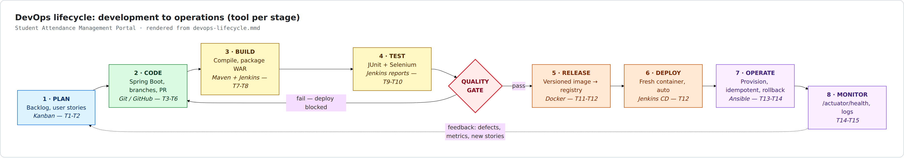

# Task 2 — Agile Planning and DevOps Workflow

**Project:** CI/CD Pipeline for a Student Attendance Management Portal (SAMP)
**Inputs:** [Task 1 — Problem Definition and Scope](01-problem-definition-and-scope.md)
**Version:** 1.0

---

## 1. Delivery approach

A **Scrumban** approach is used: Scrum supplies the sprint cadence, ceremonies and
Definition of Done; Kanban supplies a continuously visible board with WIP limits.
This fits a single-developer project where a strict Scrum team structure would be
ceremony for its own sake, but where flow control and a hard Definition of Done
still carry real value.

| Parameter | Value |
|---|---|
| Sprint length | 3 tasks per sprint (5 sprints across the 15 tasks) |
| Story point scale | Modified Fibonacci: 1, 2, 3, 5, 8, 13 |
| Velocity assumption | ~13 points per sprint |
| Board | `Backlog → Ready → In Progress → In Review → Testing → Done` |
| WIP limit | 2 (In Progress), 2 (In Review) |
| Ceremonies | Sprint planning, daily log entry, sprint review (demo), retrospective |

---

## 2. Epics

| Epic | Title | Objective served | Stories |
|---|---|---|---|
| **E1** | Access and Identity | O4 | US-01, US-02, US-03 |
| **E2** | Master Data | O1 | US-04, US-05 |
| **E3** | Attendance Capture (create / view / update / search) | O1 | US-06 … US-10 |
| **E4** | Role-Based Approval Workflow | O2 | US-11 … US-14 |
| **E5** | Summary Dashboard | O3 | US-15, US-16 |
| **E6** | Delivery Pipeline (DevOps) | O5-O10 | US-17 … US-24 |

---

## 3. User stories and acceptance criteria

### Epic E1 — Access and Identity

#### US-01 — Role-based login
> **As a** portal user
> **I want** to sign in with my own credentials
> **So that** I only see the functions my role permits.

**Acceptance criteria**

* **AC-01.1** — *Given* a registered FACULTY user, *when* they submit valid
  credentials, *then* they are redirected to the attendance list and the header
  shows their username and role.
* **AC-01.2** — *Given* any user, *when* they submit an incorrect password,
  *then* the login page is redisplayed with an "Invalid username or password"
  message and no session is created.
* **AC-01.3** — *Given* an unauthenticated visitor, *when* they request any URL
  other than `/login` or `/actuator/health`, *then* they are redirected to `/login`.

#### US-02 — Role-restricted navigation
> **As a** STUDENT
> **I want** to be prevented from reaching faculty or admin screens
> **So that** attendance data stays trustworthy.

* **AC-02.1** — *Given* a signed-in STUDENT, *when* they request `/attendance/new`,
  *then* the response is HTTP 403 and no record is created.
* **AC-02.2** — *Given* a signed-in FACULTY user, *when* they request an
  admin-only approval action, *then* the response is HTTP 403.
* **AC-02.3** — *Given* a signed-in STUDENT, *when* they view any list, *then*
  only rows belonging to that student are returned.

#### US-03 — Sign out
> **As a** user **I want** to sign out **So that** nobody can reuse my session.

* **AC-03.1** — *Given* a signed-in user, *when* they sign out, *then* the session
  is invalidated and a subsequent back-navigation to a protected page redirects to `/login`.

### Epic E2 — Master Data

#### US-04 — Maintain courses
> **As an** ADMIN **I want** to maintain courses **So that** attendance can be recorded against them.

* **AC-04.1** — *Given* an ADMIN on the course form, *when* they submit a unique
  code and title, *then* the course is saved and appears in the course list.
* **AC-04.2** — *Given* an existing course code, *when* an ADMIN submits that same
  code again, *then* a validation error "Course code already exists" is shown and
  nothing is saved.

#### US-05 — Maintain students
> **As an** ADMIN **I want** to maintain students and their course enrolment
> **So that** attendance can be recorded per student.

* **AC-05.1** — *Given* an ADMIN, *when* they add a student with a unique roll
  number, *then* the student appears in the student list.
* **AC-05.2** — *Given* a duplicate roll number, *when* submitted, *then* a
  validation error is shown and nothing is saved.

### Epic E3 — Attendance Capture

#### US-06 — Record attendance for a session *(first core workflow — Task 5)*
> **As a** FACULTY member
> **I want** to record attendance for a course session in one screen
> **So that** I stop maintaining a paper register.

* **AC-06.1** — *Given* a FACULTY user has selected a course and a session date,
  *when* the entry screen loads, *then* every student enrolled in that course is
  listed with a status selector defaulting to `PRESENT`.
* **AC-06.2** — *Given* statuses have been set, *when* the form is submitted,
  *then* one attendance record per student is created with status `DRAFT`,
  and a confirmation "Attendance saved for N students" is shown.
* **AC-06.3** — *Given* records already exist for that course and date, *when*
  the entry screen is opened again, *then* the existing values are pre-selected
  rather than duplicated.
* **AC-06.4** — *Given* a session date in the future, *when* submitted, *then* a
  validation error "Session date cannot be in the future" is shown.
* **AC-06.5** — Marking a full class of 30 completes in ≤ 60 s and ≤ 2 page loads *(S1)*.

#### US-07 — View attendance records
> **As a** FACULTY member **I want** a paged list of records **So that** I can review what was captured.

* **AC-07.1** — *Given* records exist, *when* the list is opened, *then* rows show
  student, course, session date, status and workflow state, newest session first.
* **AC-07.2** — *Given* more than 20 records, *when* the list is opened, *then*
  results are paged at 20 per page with working next/previous controls.

#### US-08 — Update an attendance record
> **As a** FACULTY member **I want** to correct a record **So that** mistakes do not reach the HoD.

* **AC-08.1** — *Given* a record in `DRAFT` or `REJECTED`, *when* its owning
  FACULTY user edits the status, *then* the change is saved and `updatedBy` /
  `updatedAt` are set to that user and the current time.
* **AC-08.2** — *Given* a record in `SUBMITTED` or `APPROVED`, *when* a FACULTY
  user attempts to edit it, *then* the edit is refused with HTTP 403 and the
  stored value is unchanged.

#### US-09 — Search and filter records
> **As a** FACULTY member or ADMIN
> **I want** to filter records by student, course, date range and workflow status
> **So that** I can answer a query without scanning registers.

* **AC-09.1** — *Given* a roll number is entered, *when* search runs, *then* only
  that student's records are returned.
* **AC-09.2** — *Given* a course and a date range, *when* search runs, *then* only
  records for that course with a session date inside the range are returned.
* **AC-09.3** — *Given* a workflow status filter, *when* search runs, *then* only
  records in that state are returned.
* **AC-09.4** — *Given* filters matching nothing, *when* search runs, *then* an
  empty-state message "No matching records" is shown rather than an error.
* **AC-09.5** — Search over the seeded dataset returns in ≤ 1 s *(S5)*.

#### US-10 — Student views own attendance
> **As a** STUDENT **I want** to see my own attendance and percentage **So that** I know where I stand.

* **AC-10.1** — *Given* a signed-in STUDENT, *when* they open their attendance
  page, *then* only their own records are listed, per course.
* **AC-10.2** — *Given* approved records exist, *when* the page loads, *then* the
  attendance percentage per course is shown, computed from approved records only.
* **AC-10.3** — *Given* a percentage below the configured threshold (default 75%),
  *when* the page loads, *then* that course is visibly flagged as a shortage.

### Epic E4 — Role-Based Approval Workflow

The state machine, frozen here and implemented in Task 6:

```
DRAFT ──submit(FACULTY)──> SUBMITTED ──approve(ADMIN)──> APPROVED  [terminal]
                               │
                               └──reject(ADMIN)──> REJECTED ──revise(FACULTY)──> DRAFT
```

#### US-11 — Submit for approval
> **As a** FACULTY member **I want** to submit a draft **So that** the HoD can verify it.

* **AC-11.1** — *Given* a record in `DRAFT`, *when* its owning FACULTY user
  submits it, *then* its state becomes `SUBMITTED` and it is no longer editable by them.
* **AC-11.2** — *Given* a record in any state other than `DRAFT`, *when* submit is
  attempted, *then* the transition is refused and the state is unchanged.

#### US-12 — Approve a submission
> **As an** ADMIN **I want** to approve a submitted record **So that** it counts towards official figures.

* **AC-12.1** — *Given* a record in `SUBMITTED`, *when* an ADMIN approves it,
  *then* its state becomes `APPROVED` and it is included in dashboard percentages.
* **AC-12.2** — *Given* a FACULTY user, *when* they attempt to approve, *then* the
  action is refused with HTTP 403 *(S4)*.
* **AC-12.3** — `APPROVED` is terminal: no transition out of it is permitted.

#### US-13 — Reject with a reason
> **As an** ADMIN **I want** to reject a submission with a reason **So that** faculty can correct it.

* **AC-13.1** — *Given* a record in `SUBMITTED`, *when* an ADMIN rejects it with a
  non-empty remark, *then* its state becomes `REJECTED` and the remark is stored and displayed.
* **AC-13.2** — *Given* an empty remark, *when* reject is submitted, *then* a
  validation error is shown and the state is unchanged.

#### US-14 — Workflow integrity and audit
> **As an** auditor **I want** every transition to be legal and attributable **So that** disputes can be settled.

* **AC-14.1** — Any transition outside the state machine above is rejected by the
  service layer, not merely hidden in the UI *(S6)*.
* **AC-14.2** — Every transition records who performed it and when.

### Epic E5 — Summary Dashboard

#### US-15 — Department summary dashboard
> **As an** ADMIN **I want** a summary dashboard **So that** I can see standing at a glance.

* **AC-15.1** — *Given* approved records exist, *when* the dashboard loads, *then*
  attendance percentage per student per course is shown.
* **AC-15.2** — *Given* records in various states, *when* the dashboard loads,
  *then* counts per workflow state (`DRAFT`/`SUBMITTED`/`APPROVED`/`REJECTED`) are shown.
* **AC-15.3** — *Given* a student below the threshold, *when* the dashboard loads,
  *then* that row is highlighted; **100%** of below-threshold students are flagged *(S3)*.
* **AC-15.4** — The threshold is read from configuration, not hard-coded *(A4)*.

#### US-16 — Pending-approval queue
> **As an** ADMIN **I want** to see what is awaiting my approval **So that** nothing is forgotten.

* **AC-16.1** — *Given* submitted records exist, *when* the dashboard loads, *then*
  a count and a link to the filtered `SUBMITTED` queue are shown.

### Epic E6 — Delivery Pipeline (DevOps)

#### US-17 — Version-controlled project
> **As a** developer **I want** one repository with a documented branch policy **So that** work is traceable *(O5)*.

* **AC-17.1** — Repository contains README, `.gitignore`, issue templates and a documented branch naming rule.
* **AC-17.2** — Feature work reaches the development branch through a pull request, not a direct push.

#### US-18 — Automated build on commit
> **As a** developer **I want** every commit built automatically **So that** breakage is caught immediately *(O6)*.

* **AC-18.1** — A commit to the development branch starts a Jenkins build without manual action *(S7)*.
* **AC-18.2** — A successful build archives the packaged artefact *(S8)*.
* **AC-18.3** — Commit to archived artefact completes in ≤ 5 minutes *(S9)*.

#### US-19 — Pipeline as code
> **As a** developer **I want** the pipeline defined in the repository **So that** it is reviewable and reproducible *(O7)*.

* **AC-19.1** — All stages (checkout, build, test, package, deploy) are declared in `Jenkinsfile` *(S10)*.
* **AC-19.2** — At least one environment setting is parameterised rather than hard-coded.

#### US-20 — Automated UI regression suite
> **As a** developer **I want** critical journeys covered by Selenium **So that** regressions are caught before users see them *(O8)*.

* **AC-20.1** — 3-5 critical journeys are automated with explicit assertions.
* **AC-20.2** — A failing test captures a screenshot for diagnosis.
* **AC-20.3** — The suite runs locally through Maven with a single command.

#### US-21 — Quality gate blocks deployment
> **As a** HoD **I want** a failing test to stop the release **So that** defects never reach the portal *(O8)*.

* **AC-21.1** — *Given* a failing Selenium test, *when* the pipeline runs, *then*
  the build is marked failed and the deploy stage **does not execute** *(S11)*.
* **AC-21.2** — Test results are published and visible in Jenkins.
* **AC-21.3** — *Given* the defect is corrected, *when* the pipeline reruns, *then* it passes and deployment proceeds *(S12)*.

#### US-22 — Containerised, versioned release
> **As an** operator **I want** each release as a versioned image **So that** deployments are reproducible *(O9)*.

* **AC-22.1** — The application builds into a Docker image from a committed `Dockerfile`.
* **AC-22.2** — Every image is tagged with the build number **and** `latest` *(S14)*.
* **AC-22.3** — Images are published to a registry.
* **AC-22.4** — A started container answers `/actuator/health` within 60 s *(S13)*.

#### US-23 — Automated deployment
> **As an** operator **I want** a fresh container deployed automatically after tests pass **So that** releases need no manual steps *(O9)*.

* **AC-23.1** — No manual step exists between `git push` and a new running container *(S15)*.

#### US-24 — Reproducible environment and recovery
> **As an** operator **I want** the server built from code with a tested rollback **So that** recovery is routine *(O10)*.

* **AC-24.1** — Prerequisites (packages, users, directories, ports, services) are declared in an Ansible playbook.
* **AC-24.2** — A second run on an already-configured node reports `changed=0` *(S16)*.
* **AC-24.3** — A health check confirms the deployed application responds.
* **AC-24.4** — Rollback restores the previous stable version, healthy, within 5 minutes *(S17)*.

---

## 4. Product backlog

Priority uses MoSCoW: **M**ust / **S**hould / **C**ould / **W**on't (this release).

| ID | Story (abbreviated) | Epic | Priority | Pts | Delivered in |
|---|---|---|---|---|---|
| US-17 | Version-controlled project with branch policy | E6 | M | 3 | Task 4 |
| US-01 | Role-based login | E1 | M | 3 | Task 5 |
| US-06 | Record attendance for a session | E3 | M | 8 | Task 5 |
| US-07 | View attendance records (paged) | E3 | M | 3 | Task 5 |
| US-02 | Role-restricted navigation | E1 | M | 3 | Task 6 |
| US-03 | Sign out | E1 | M | 1 | Task 6 |
| US-04 | Maintain courses | E2 | M | 2 | Task 6 |
| US-05 | Maintain students | E2 | M | 2 | Task 6 |
| US-08 | Update an attendance record | E3 | M | 3 | Task 6 |
| US-09 | Search and filter records | E3 | M | 5 | Task 6 |
| US-10 | Student views own attendance | E3 | M | 3 | Task 6 |
| US-11 | Submit for approval | E4 | M | 3 | Task 6 |
| US-12 | Approve a submission | E4 | M | 3 | Task 6 |
| US-13 | Reject with a reason | E4 | M | 2 | Task 6 |
| US-14 | Workflow integrity and audit | E4 | M | 5 | Task 6 |
| US-15 | Summary dashboard | E5 | M | 5 | Task 6 |
| US-16 | Pending-approval queue | E5 | S | 2 | Task 6 |
| US-18 | Automated build on commit | E6 | M | 5 | Task 7 |
| US-19 | Pipeline as code | E6 | M | 5 | Task 8 |
| US-20 | Automated UI regression suite | E6 | M | 8 | Task 9 |
| US-21 | Quality gate blocks deployment | E6 | M | 5 | Task 10 |
| US-22 | Containerised, versioned release | E6 | M | 5 | Tasks 11-12 |
| US-23 | Automated deployment | E6 | M | 5 | Task 12 |
| US-24 | Reproducible environment and recovery | E6 | M | 8 | Tasks 13-14 |

**Total: 97 points across 24 stories.**

### Deferred (Won't — this release)

| Item | Reason |
|---|---|
| Biometric / RFID capture | Hardware dependency |
| SMS/e-mail alerts to parents | Needs a paid gateway (C12) |
| LDAP / SSO | Assumption A3 |
| PDF / Excel export | Dashboard satisfies O3 |
| Kubernetes orchestration | Constraint C6 |

---

## 5. Sprint plan

| Sprint | Tasks | Theme | Points | Sprint goal |
|---|---|---|---|---|
| **S1** | 1-3 | Inception and design | — | Scope frozen, backlog ready, architecture and local setup working |
| **S2** | 4-6 | Application MVP | 54 | A functional, tagged, release-ready portal in Git |
| **S3** | 7-9 | Continuous integration | 18 | Every commit builds automatically; Selenium suite runs locally |
| **S4** | 10-12 | Continuous testing and delivery | 15 | Tests gate deployment; commit produces a running container |
| **S5** | 13-15 | Infrastructure and release | 8 | Environment provisioned from code, rollback proven, documented |

### Sprint review and retrospective

Each sprint closes with a demo of the running software or pipeline, and a
retrospective recorded in the task's document. The evidence pack
(`docs/evidence/`) is the demo artefact.

---

## 6. Kanban board

Column entry rules are what make the board honest — a card may only move right
when the stated condition holds.

| Column | WIP | A card may enter when… |
|---|---|---|
| **Backlog** | ∞ | The story exists with a user-value statement |
| **Ready** | 6 | It satisfies the Definition of Ready (§7) |
| **In Progress** | 2 | A feature branch exists for it |
| **In Review** | 2 | A pull request is open and the build is green |
| **Testing** | 2 | It is merged and the Selenium suite has run against it |
| **Done** | ∞ | It satisfies the Definition of Done (§8) |

### Board state at the end of Task 2

| Backlog | Ready | In Progress | In Review | Testing | Done |
|---|---|---|---|---|---|
| US-18 … US-24 (7) | US-01 … US-17 (17) | — | — | — | Task 1, Task 2 |

### Blocked policy

A card that cannot progress is tagged `blocked` with the reason recorded in the
task document. Blocked cards keep occupying their WIP slot — this is deliberate,
so that an impediment is visible rather than silently worked around.

---

## 7. Definition of Ready

A story may enter **Ready** only when **all** of the following hold:

1. It is written as a user story with a stated beneficiary and value.
2. It has testable acceptance criteria in Given/When/Then form.
3. It is estimated in story points.
4. It is small enough to finish inside one task.
5. Its dependencies are either delivered or explicitly noted.
6. Any UI element a Selenium test must drive has an agreed `data-testid`.
7. It maps to at least one objective (O1-O10) from Task 1.

---

## 8. Definition of Done

A story is **Done** only when **all** of the following hold. This is the single
quality bar for the whole project.

### Code
1. Implemented to its acceptance criteria, with no criterion unmet.
2. Reviewed through a pull request and merged to the development branch.
3. No commented-out code, no debug printing, no hard-coded environment values.
4. Follows the project structure and naming conventions from Task 3.

### Tests
5. Unit tests cover the business rules the story introduces, especially workflow transitions.
6. Where the story touches a critical journey, a Selenium test asserts it.
7. The full suite passes — a story is never Done with a known failing test.

### Pipeline
8. The Jenkins build is green on the merge commit.
9. The packaged artefact is produced and archived.
10. From Task 12 onward, a container is built, published and deployed automatically.

### Documentation and evidence
11. The task document in `docs/` is written.
12. **Screenshot evidence is captured in `docs/evidence/task-NN/` and indexed**,
    per the rules in [`docs/evidence/README.md`](evidence/README.md).
13. `docs/00-PROJECT-PLAN.md` status is updated.
14. Work is committed with a descriptive message and pushed.

### Explicitly NOT Done
* "It works on my machine" — the pipeline must prove it.
* A disabled, skipped or quarantined test to force a green build.
* A screenshot that was not produced by a real execution.

---

## 9. DevOps lifecycle workflow

The full path from development to operations, naming the tool used at each stage
and the gate that separates them.



*Vector version: [`docs/diagrams/devops-lifecycle.svg`](diagrams/devops-lifecycle.svg) ·
source: [`docs/diagrams/devops-lifecycle.mmd`](diagrams/devops-lifecycle.mmd) (GitHub renders it natively below)*

```mermaid
flowchart LR
    classDef plan fill:#ddf4ff,stroke:#0969da,stroke-width:1.5px,color:#0a3069
    classDef dev  fill:#dafbe1,stroke:#1a7f37,stroke-width:1.5px,color:#0a3622
    classDef ci   fill:#fff8c5,stroke:#9a6700,stroke-width:1.5px,color:#4d2d00
    classDef cd   fill:#ffe8d4,stroke:#bc4c00,stroke-width:1.5px,color:#762c00
    classDef ops  fill:#fbefff,stroke:#8250df,stroke-width:1.5px,color:#3e1f79
    classDef gate fill:#ffebe9,stroke:#cf222e,stroke-width:2.5px,color:#82071e

    P["<b>1 · PLAN</b><br/>Backlog, user stories<br/><i>Kanban — T1-T2</i>"]:::plan
    C["<b>2 · CODE</b><br/>Spring Boot, branches, PR<br/><i>Git / GitHub — T3-T6</i>"]:::dev
    B["<b>3 · BUILD</b><br/>Compile, package WAR<br/><i>Maven + Jenkins — T7-T8</i>"]:::ci
    T["<b>4 · TEST</b><br/>JUnit + Selenium<br/><i>Jenkins reports — T9-T10</i>"]:::ci
    G{"<b>QUALITY</b><br/><b>GATE</b>"}:::gate
    R["<b>5 · RELEASE</b><br/>Versioned image → registry<br/><i>Docker — T11-T12</i>"]:::cd
    D["<b>6 · DEPLOY</b><br/>Fresh container, auto<br/><i>Jenkins CD — T12</i>"]:::cd
    O["<b>7 · OPERATE</b><br/>Provision, idempotent, rollback<br/><i>Ansible — T13-T14</i>"]:::ops
    M["<b>8 · MONITOR</b><br/>/actuator/health, logs<br/><i>T14-T15</i>"]:::ops

    P --> C --> B --> T --> G
    G -- "pass" --> R --> D --> O --> M
    G -- "fail — deploy blocked" --> C
    M -. "feedback: defects, metrics, new stories" .-> P
```



### Stage-to-tool mapping

| # | Stage | Tool | Produces | Task |
|---|---|---|---|---|
| 1 | Plan | Backlog, Kanban board, this document | Prioritised stories | 1-2 |
| 2 | Code | Git, GitHub, feature branches, pull requests | Reviewed source | 3-6 |
| 3 | Build | Maven on Jenkins | Compiled, archived WAR | 7-8 |
| 4 | Test | JUnit 5, Selenium WebDriver, Jenkins reports | Pass/fail + screenshots | 9-10 |
| — | **Quality gate** | Jenkins pipeline condition | **Blocks deploy on failure** | 10 |
| 5 | Release | Docker build/tag/push | Versioned image in registry | 11-12 |
| 6 | Deploy | Jenkins CD stage | Running container | 12 |
| 7 | Operate | Ansible playbook, Tomcat/Docker runtime | Provisioned node, rollback | 13-14 |
| 8 | Monitor | `/actuator/health`, container and build logs | Health signal | 14-15 |

### The feedback loop

Monitoring feeds back into planning. In this project that loop is demonstrated
concretely in **Task 10**: a defect is deliberately introduced, the Selenium gate
catches it, deployment is blocked, a correction is committed, and the pipeline is
rerun to green. That cycle — detect, block, fix, re-verify — is the whole point of
the pipeline, and it is the one piece of evidence that cannot be faked by a
screenshot of a passing build.

---

## 10. Task 2 deliverable checklist

- [x] User stories with Given/When/Then acceptance criteria (§3) — 24 stories, 6 epics
- [x] Product backlog with MoSCoW priority and story points (§4)
- [x] Sprint plan mapping the 15 tasks to 5 sprints (§5)
- [x] Kanban board with WIP limits and column entry rules (§6)
- [x] Definition of Ready (§7)
- [x] Definition of Done (§8)
- [x] DevOps lifecycle diagram, development to operations (§9)
- [x] Screenshot evidence in `docs/evidence/task-02/`
