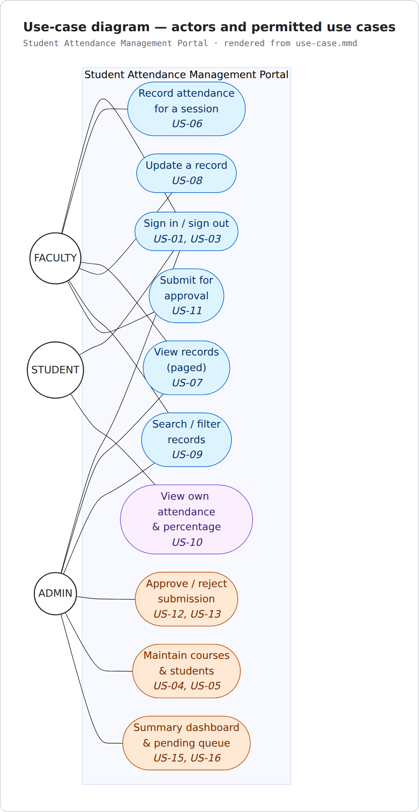
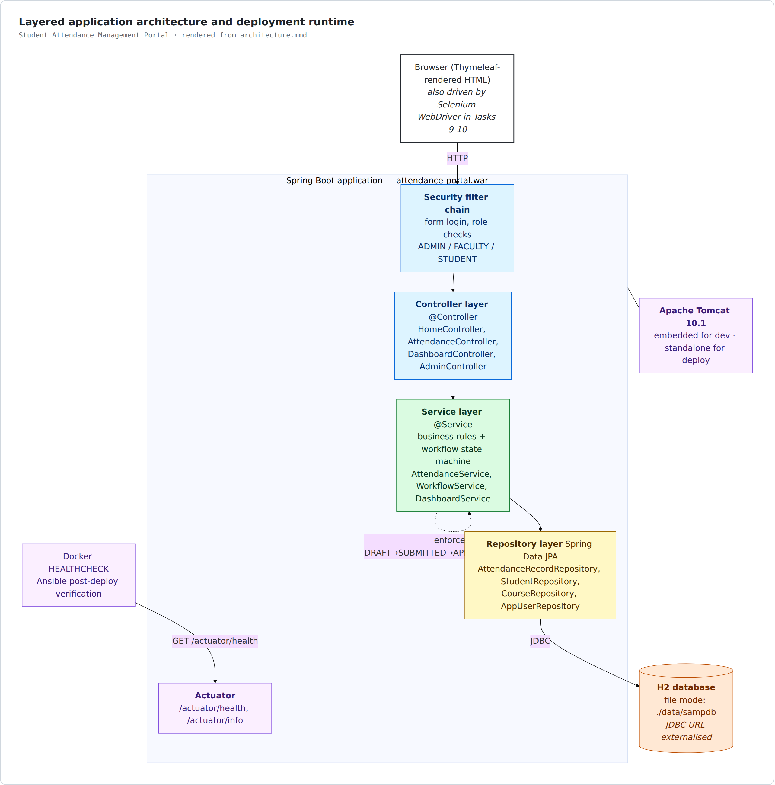
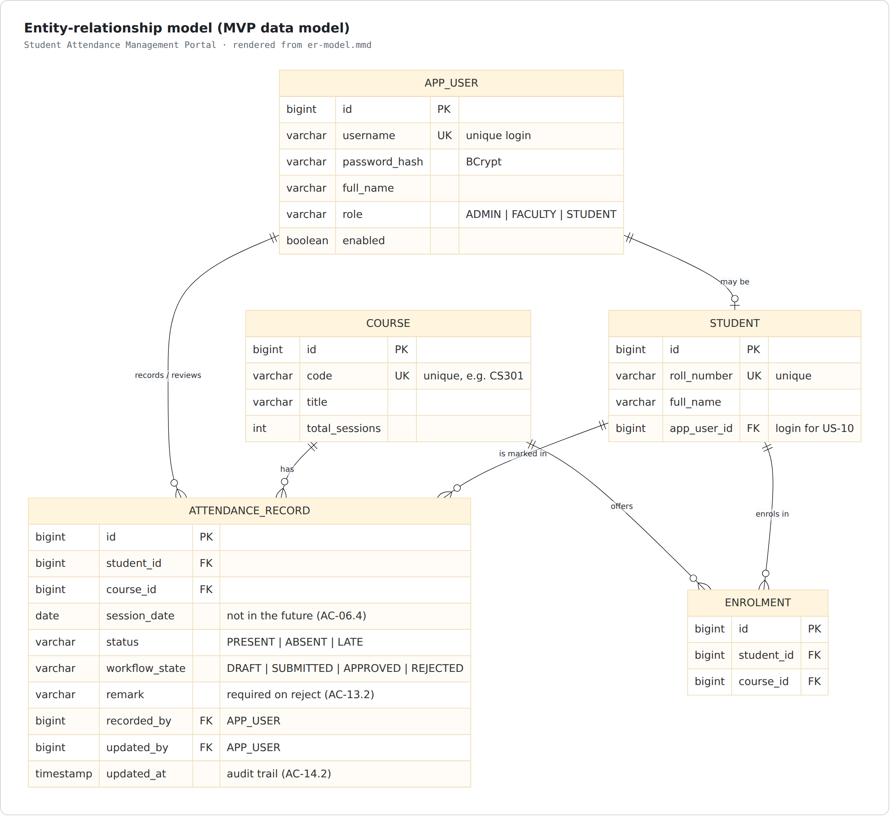
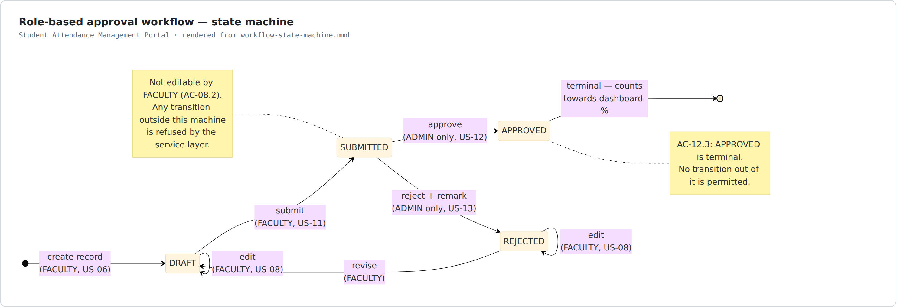
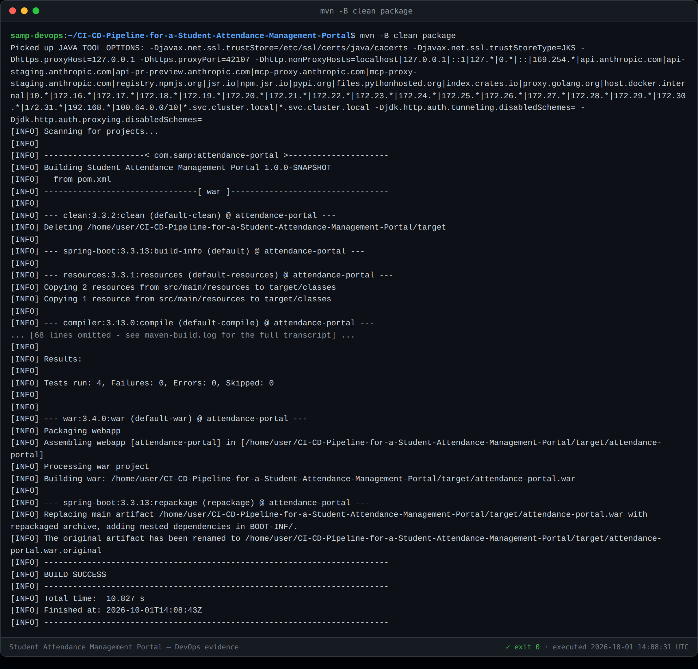
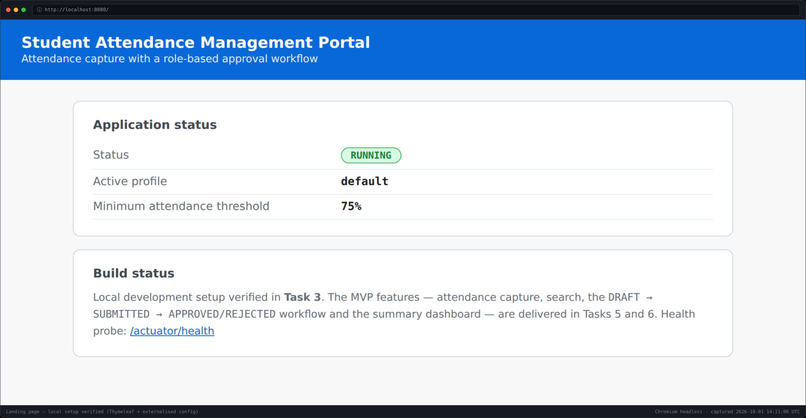
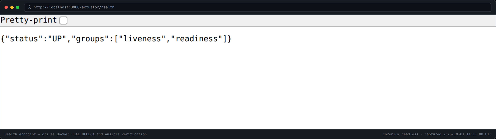

# Task 3 — Requirements, Architecture and Technology Setup

**Project:** CI/CD Pipeline for a Student Attendance Management Portal (SAMP)
**Inputs:** [Task 1 — Scope](01-problem-definition-and-scope.md) · [Task 2 — Backlog and DoD](02-agile-planning.md)
**Version:** 1.0 · **Status:** local setup verified by a real build and run (§9)

---

## 1. SRS summary

### 1.1 Functional requirements

Each requirement traces to the user story that specifies it and the acceptance
criteria that prove it.

| ID | Requirement | Story | Priority |
|---|---|---|---|
| **FR-01** | The system shall authenticate users against stored credentials and establish a role-bound session. | US-01 | Must |
| **FR-02** | The system shall restrict every page and action to the roles permitted to use it (ADMIN, FACULTY, STUDENT). | US-02 | Must |
| **FR-03** | The system shall allow a user to terminate their session. | US-03 | Must |
| **FR-04** | The system shall allow an ADMIN to create and maintain courses with a unique course code. | US-04 | Must |
| **FR-05** | The system shall allow an ADMIN to create and maintain students with a unique roll number, and enrol them on courses. | US-05 | Must |
| **FR-06** | The system shall allow a FACULTY user to record attendance for every student enrolled on a course for a given session date, as PRESENT, ABSENT or LATE. | US-06 | Must |
| **FR-07** | The system shall reject a session date in the future. | US-06 | Must |
| **FR-08** | The system shall present existing records for a course and date rather than creating duplicates. | US-06 | Must |
| **FR-09** | The system shall list attendance records with paging at 20 rows per page. | US-07 | Must |
| **FR-10** | The system shall allow correction of a record while it is in DRAFT or REJECTED, and refuse correction in SUBMITTED or APPROVED. | US-08 | Must |
| **FR-11** | The system shall support search by roll number, course, session-date range and workflow state, in any combination. | US-09 | Must |
| **FR-12** | The system shall show a STUDENT only their own records, with attendance percentage per course. | US-10 | Must |
| **FR-13** | The system shall flag a course where a student's percentage is below the configured threshold. | US-10, US-15 | Must |
| **FR-14** | The system shall allow a FACULTY user to submit a DRAFT record for approval. | US-11 | Must |
| **FR-15** | The system shall allow only an ADMIN to approve a SUBMITTED record, making it APPROVED and terminal. | US-12 | Must |
| **FR-16** | The system shall allow only an ADMIN to reject a SUBMITTED record, requiring a non-empty remark. | US-13 | Must |
| **FR-17** | The system shall refuse any state transition outside the defined state machine at the service layer. | US-14 | Must |
| **FR-18** | The system shall record who performed each change and when. | US-14 | Must |
| **FR-19** | The system shall present a dashboard with attendance percentage per student per course and counts per workflow state. | US-15 | Must |
| **FR-20** | The system shall show the count of records awaiting approval, linked to the filtered queue. | US-16 | Should |

### 1.2 Non-functional requirements

| ID | Requirement | Target | Verified by |
|---|---|---|---|
| **NFR-01** | Usability — mark a full class | ≤ 60 s, ≤ 2 page loads | Selenium journey (Task 9), S1 |
| **NFR-02** | Performance — search response | ≤ 1 s on the seeded dataset | Selenium journey (Task 9), S5 |
| **NFR-03** | Security — access control | 0 successful cross-role accesses | Security tests (Tasks 6, 9), S4 |
| **NFR-04** | Security — credential storage | No plaintext passwords; BCrypt hashing | Code review (Task 5) |
| **NFR-05** | Auditability | Every transition attributable to a user and time | Unit tests (Task 6) |
| **NFR-06** | Testability | All Selenium-driven elements carry a stable `data-testid` | DoR condition 6 |
| **NFR-07** | Observability | `/actuator/health` responds without authentication | **Verified in §9**, S13 |
| **NFR-08** | Portability | One artefact runs via embedded Tomcat and deploys to standalone Tomcat 10.1 | WAR packaging, §4 |
| **NFR-09** | Configurability | Port, datasource and threshold externalised, no rebuild to change | **Verified in §9**, §7 |
| **NFR-10** | Build reproducibility | Pinned Spring Boot and plugin versions; no version ranges | `pom.xml` |
| **NFR-11** | Startup time | Container healthy within 60 s | **8 s measured in §9**, S13 |

### 1.3 Assumptions carried forward

A1 LAN access only · A2 single academic term · A3 local authentication ·
A4 configurable threshold. (Defined in Task 1 §6.3.)

---

## 2. Use-case view



*Source: [`use-case.mmd`](diagrams/use-case.mmd) · vector: [`use-case.svg`](diagrams/use-case.svg)*

| Actor | Permitted use cases |
|---|---|
| **FACULTY** | Sign in/out · Record attendance · View records · Update record · Search · Submit for approval |
| **ADMIN** | Sign in/out · View records · Search · **Approve/reject** · Maintain courses and students · Dashboard and pending queue |
| **STUDENT** | Sign in/out · View own attendance and percentage |

The separation that matters: **FACULTY can submit but never approve; ADMIN
approves but does not capture.** That is the separation of duties missing from
the spreadsheet process (pain point P6).

---

## 3. Architecture



*Source: [`architecture.mmd`](diagrams/architecture.mmd) · vector: [`architecture.svg`](diagrams/architecture.svg)*

### 3.1 Layers and responsibilities

| Layer | Package | Responsibility | Rule |
|---|---|---|---|
| Security filter chain | `config` | Authentication, role checks | Runs before any controller |
| Controller | `web` | HTTP binding, form validation, view selection | No business rules |
| Service | `service` | Business rules, **workflow state machine**, percentage calculation | Transaction boundary |
| Repository | `repository` | Data access via Spring Data JPA | No business rules |
| Domain | `domain` | Entities and enums | Persistence-annotated |

### 3.2 Why this shape

* **Server-rendered Thymeleaf, not a JavaScript SPA.** The Selenium quality gate
  (Tasks 9-10) is the centre of this project. Server-rendered HTML gives stable,
  synchronously-available DOM that Selenium can assert against without
  fighting asynchronous hydration — which directly reduces risk R1 (flaky tests).
* **The state machine lives in the service layer, not the UI.** AC-14.1 requires
  that an illegal transition is *refused*, not merely un-clickable. A hidden
  button is not access control.
* **WAR packaging with `provided` embedded Tomcat.** One artefact satisfies both
  "runs locally" and "deploys to Tomcat" (constraint C2) with no second build.
* **H2 in file mode behind an externalised JDBC URL.** Satisfies constraint C6
  (single low-resource node) while keeping the migration to PostgreSQL a
  configuration change rather than a code change.

---

## 4. Data model



*Source: [`er-model.mmd`](diagrams/er-model.mmd) · vector: [`er-model.svg`](diagrams/er-model.svg)*

### 4.1 Tables

**`APP_USER`** — login identity and role.

| Column | Type | Constraints |
|---|---|---|
| `id` | bigint | PK, generated |
| `username` | varchar(50) | **unique**, not null |
| `password_hash` | varchar(100) | not null, BCrypt (NFR-04) |
| `full_name` | varchar(100) | not null |
| `role` | varchar(20) | not null, `ADMIN` \| `FACULTY` \| `STUDENT` |
| `enabled` | boolean | not null, default true |

**`COURSE`**

| Column | Type | Constraints |
|---|---|---|
| `id` | bigint | PK |
| `code` | varchar(20) | **unique**, not null (AC-04.2) |
| `title` | varchar(150) | not null |
| `total_sessions` | int | not null, ≥ 0 — denominator for percentage |

**`STUDENT`**

| Column | Type | Constraints |
|---|---|---|
| `id` | bigint | PK |
| `roll_number` | varchar(30) | **unique**, not null (AC-05.2) |
| `full_name` | varchar(100) | not null |
| `app_user_id` | bigint | FK → `APP_USER`, nullable — links a student to their login (US-10) |

**`ENROLMENT`** — which students are in which course; drives the entry screen roster (AC-06.1).

| Column | Type | Constraints |
|---|---|---|
| `id` | bigint | PK |
| `student_id` | bigint | FK → `STUDENT`, not null |
| `course_id` | bigint | FK → `COURSE`, not null |
| | | **unique(`student_id`,`course_id`)** |

**`ATTENDANCE_RECORD`** — the core table.

| Column | Type | Constraints |
|---|---|---|
| `id` | bigint | PK |
| `student_id` | bigint | FK → `STUDENT`, not null |
| `course_id` | bigint | FK → `COURSE`, not null |
| `session_date` | date | not null, **not in the future** (FR-07) |
| `status` | varchar(10) | not null, `PRESENT` \| `ABSENT` \| `LATE` |
| `workflow_state` | varchar(10) | not null, `DRAFT` \| `SUBMITTED` \| `APPROVED` \| `REJECTED` |
| `remark` | varchar(500) | required when rejecting (AC-13.2) |
| `recorded_by` | bigint | FK → `APP_USER`, not null |
| `updated_by` | bigint | FK → `APP_USER` |
| `updated_at` | timestamp | not null (FR-18) |
| | | **unique(`student_id`,`course_id`,`session_date`)** — enforces FR-08 |

### 4.2 Attendance percentage

```
percentage(student, course) = 100 × count(APPROVED records where status in (PRESENT, LATE))
                                  ────────────────────────────────────────────────────────
                                            count(APPROVED records)
```

Only `APPROVED` records count, which is the whole point of the workflow: an
unverified draft must never move the official number. `LATE` counts as attended.
A student with no approved records shows "—", not 0%, so an empty record is not
mistaken for a shortage.

---

## 5. Workflow state machine



*Source: [`workflow-state-machine.mmd`](diagrams/workflow-state-machine.mmd) · vector: [`workflow-state-machine.svg`](diagrams/workflow-state-machine.svg)*

| From | Event | To | Permitted role |
|---|---|---|---|
| *(none)* | create | `DRAFT` | FACULTY |
| `DRAFT` | edit | `DRAFT` | FACULTY (owner) |
| `DRAFT` | submit | `SUBMITTED` | FACULTY (owner) |
| `SUBMITTED` | approve | `APPROVED` | **ADMIN only** |
| `SUBMITTED` | reject (+remark) | `REJECTED` | **ADMIN only** |
| `REJECTED` | edit | `REJECTED` | FACULTY (owner) |
| `REJECTED` | revise | `DRAFT` | FACULTY (owner) |
| `APPROVED` | — | — | **terminal (AC-12.3)** |

Everything not in this table is refused by the service layer with HTTP 403.

---

## 6. API / endpoint list

| Method | Path | Role | Story |
|---|---|---|---|
| `GET` | `/` | public | — |
| `GET`/`POST` | `/login`, `/logout` | public | US-01, US-03 |
| `GET` | `/attendance` | FACULTY, ADMIN | US-07 |
| `GET` | `/attendance/new` | FACULTY | US-06 |
| `POST` | `/attendance` | FACULTY | US-06 |
| `GET` | `/attendance/{id}/edit` | FACULTY (owner) | US-08 |
| `POST` | `/attendance/{id}` | FACULTY (owner) | US-08 |
| `GET` | `/attendance/search` | FACULTY, ADMIN | US-09 |
| `POST` | `/attendance/{id}/submit` | FACULTY (owner) | US-11 |
| `POST` | `/attendance/{id}/approve` | **ADMIN** | US-12 |
| `POST` | `/attendance/{id}/reject` | **ADMIN** | US-13 |
| `GET` | `/my-attendance` | STUDENT | US-10 |
| `GET` | `/dashboard` | ADMIN | US-15, US-16 |
| `GET` | `/admin/courses`, `/admin/students` | ADMIN | US-04, US-05 |
| `GET` | `/actuator/health` | public | NFR-07 |
| `GET` | `/actuator/info` | public | traceability |

---

## 7. Configuration and port map

### 7.1 Externalised settings

Every value the pipeline varies is an environment variable with a local default
(AC-19.2), so one artefact runs unchanged everywhere.

| Variable | Default | Purpose |
|---|---|---|
| `SERVER_PORT` | `8080` | HTTP port |
| `CONTEXT_PATH` | `/` | Servlet context path |
| `DB_URL` | `jdbc:h2:file:./data/sampdb` | JDBC URL — swap for PostgreSQL without a rebuild |
| `DB_USERNAME` / `DB_PASSWORD` | `sa` / *(empty)* | Credentials |
| `JPA_DDL_AUTO` | `update` | Schema management |
| `ATTENDANCE_THRESHOLD` | `75` | **Minimum attendance %** (A4, AC-15.4) |
| `H2_CONSOLE` | `false` | Dev-only console |
| `LOG_LEVEL` / `APP_LOG_LEVEL` | `INFO` | Logging |

> **Note on the H2 URL.** The URL deliberately carries no extra settings. H2 2.x
> refuses `AUTO_SERVER=TRUE` combined with `DB_CLOSE_ON_EXIT=FALSE`
> ("Feature not supported"), and neither is needed: a single JVM owns the file and
> shutdown is graceful. This was found by running the application, not by the
> tests — see §9.2.

### 7.2 Port map (fixed now to avoid collisions later — risk R5)

| Port | Service | Task |
|---|---|---|
| **8080** | Portal (dev, embedded Tomcat) | 3 |
| **8081** | Portal (deployed container) | 12 |
| **8082** | Standalone Tomcat | 8 |
| **8090** | Jenkins | 7 |
| **5000** | Local Docker registry | 12 |

---

## 8. Project structure

```
attendance-portal/
├── pom.xml                       Maven build, Spring Boot 3.3.13, Java 17, war
├── src/main/java/com/samp/attendance/
│   ├── AttendanceApplication.java      entry point
│   ├── ServletInitializer.java         standalone-Tomcat bootstrap
│   ├── config/SecurityConfig.java      filter chain, role rules
│   ├── web/                            controllers
│   ├── service/                        business rules + state machine   (Tasks 5-6)
│   ├── repository/                     Spring Data JPA                  (Tasks 5-6)
│   └── domain/                         entities and enums               (Tasks 5-6)
├── src/main/resources/
│   ├── application.properties          externalised configuration
│   ├── application-dev.properties      dev profile
│   └── templates/                      Thymeleaf views
├── src/test/java/com/samp/attendance/  JUnit 5; selenium/ added in Task 9
├── scripts/
│   ├── app-control.sh                  start/stop/wait for the app
│   └── capture/                        evidence tooling
└── docs/                               task documents, diagrams, evidence
```

---

## 9. Working local setup — verified

### 9.1 Build

```bash
mvn -B clean package
```

Result: **BUILD SUCCESS**, 4 tests passed, `target/attendance-portal.war` produced (54 MB).



### 9.2 One real defect found by running it

The build passed while the application could not start. The smoke tests override
`spring.datasource.url` with in-memory H2, so the **file-mode default was never
exercised by any test**. Starting the application for real produced:

```
Caused by: org.h2.jdbc.JdbcSQLFeatureNotSupportedException:
  Feature not supported: "AUTO_SERVER=TRUE && DB_CLOSE_ON_EXIT=FALSE"
```

H2 2.x refuses that combination. Both settings were removed (neither is needed
for a single-JVM file database with graceful shutdown).

**The lesson, recorded because it shapes later tasks:** a green unit-test run is
not evidence that the deployable configuration works. This is precisely the gap
the Selenium gate (Task 10), the container health check (Task 11) and the Ansible
post-deploy verification (Task 14) exist to close.

### 9.3 Run

```bash
scripts/app-control.sh start --port 8080     # → UP after 8s
```

Startup **8 s**, comfortably inside the 60 s target of NFR-11/S13.



The landing page reads its values from configuration — the `75%` threshold shown
is `ATTENDANCE_THRESHOLD` resolved at runtime, demonstrating NFR-09.



`/actuator/health` answers `{"status":"UP"}` **without authentication**, which is
what the Docker `HEALTHCHECK` (Task 11) and the Ansible verification (Task 14)
depend on (NFR-07).

---

## 10. Task 3 deliverable checklist

- [x] SRS summary — 20 functional + 11 non-functional requirements, traced to stories (§1)
- [x] Use-case diagram (§2)
- [x] Architecture diagram with layer responsibilities and design rationale (§3)
- [x] Data model — ER diagram, 5 tables, constraints, percentage rule (§4)
- [x] Workflow state machine with permitted transitions per role (§5)
- [x] API / endpoint list (§6)
- [x] Configuration parameters and port map (§7)
- [x] Project structure (§8)
- [x] **Working local setup, verified by a real build and a real run** (§9)
- [x] Screenshot evidence in `docs/evidence/task-03/`
