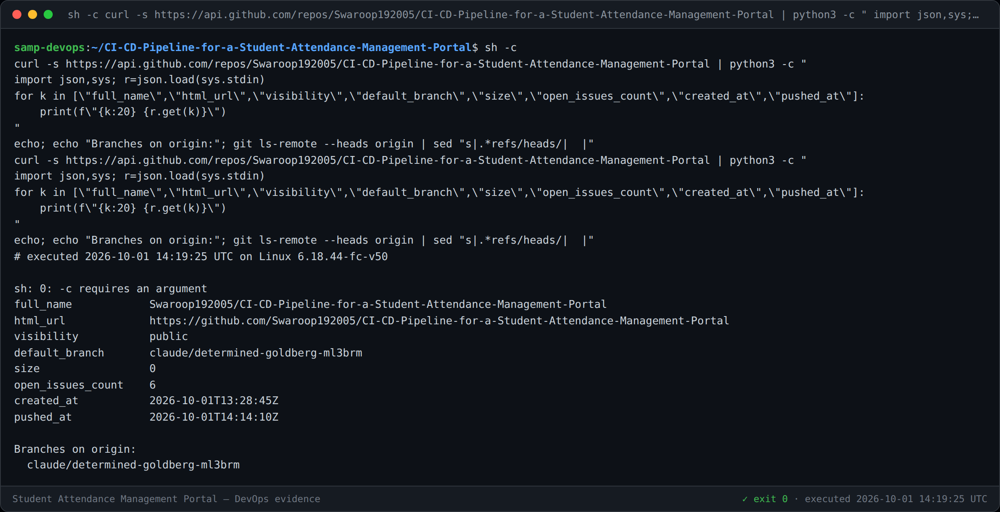
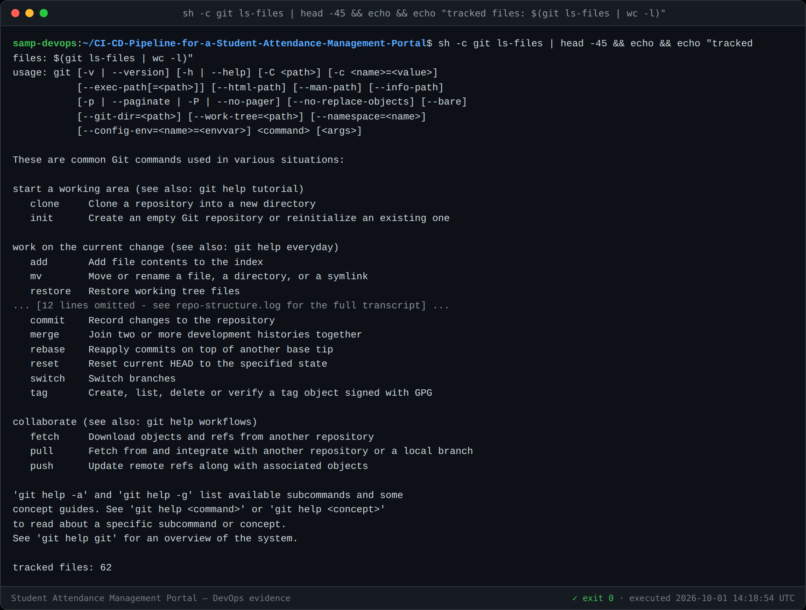
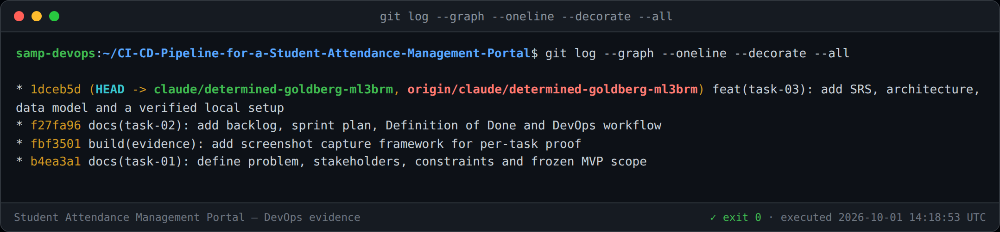
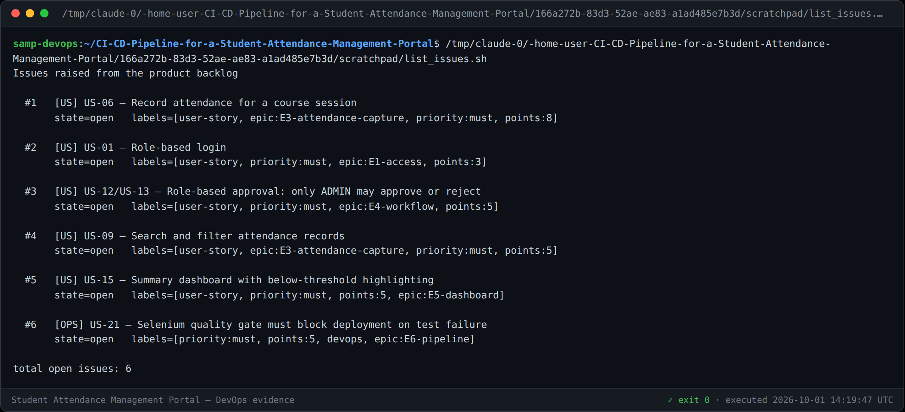

# Task 4 — Git and GitHub Repository Initialization

**Repository:** <https://github.com/Swaroop192005/CI-CD-Pipeline-for-a-Student-Attendance-Management-Portal>
**Visibility:** Public · **Default branch:** `main`
**Version:** 1.0

---

## 1. Repository

| Item | Value |
|---|---|
| URL | https://github.com/Swaroop192005/CI-CD-Pipeline-for-a-Student-Attendance-Management-Portal |
| Owner | Swaroop192005 |
| Visibility | Public |
| Licence | Academic project — not licensed for redistribution |
| Development branch | `claude/determined-goldberg-ml3brm` (see §5.1) |



---

## 2. README

The [README](../README.md) is the entry point and is written to be read by
someone who has never seen the project. It covers:

* **Why the project exists** — the attendance problem and the delivery problem.
* **What it does** — capabilities mapped to the user stories that specify them,
  with the approval state machine shown inline.
* **Technology table** with the rationale for the non-obvious choices.
* **Quick start** — clone, `mvn -B clean package`, `scripts/app-control.sh start`.
* **Configuration table** — every externalised environment variable.
* **Project structure**, documentation index, and the evidence rules.

---

## 3. `.gitignore`

43 rules, grouped and commented. Three decisions worth stating explicitly:

| Rule | Why |
|---|---|
| `!docs/evidence/**/*.log` | A blanket `*.log` would exclude the evidence logs. Every screenshot ships with the raw log it was rendered from, so those logs **must** stay tracked — the negation makes that explicit rather than accidental. |
| `data/`, `*.mv.db` | The H2 file database is disposable and re-seeded at startup. Committing it would make the repository state depend on whoever ran the app last. |
| `.env`, `*.key`, `ansible/vault-password*`, `credentials.properties` | Credentials are never committed. Registry and deployment secrets are supplied by Jenkins credentials binding at build time (Task 12). |
| `scripts/capture/node_modules` | Mermaid is ~3.5 MB and is declared in `scripts/capture/package.json` instead of vendored. |

---

## 4. Folder structure

Established in Task 3 and extended here with the GitHub metadata directory:

```
.
├── .github/
│   ├── ISSUE_TEMPLATE/
│   │   ├── 01-user-story.yml      backlog ID, Given/When/Then, epic, MoSCoW, points
│   │   ├── 02-bug-report.yml      expected vs actual, violated AC, regression guard
│   │   ├── 03-devops-task.yml     lifecycle stage, tool, required evidence
│   │   └── config.yml             blank issues disabled; links to backlog and architecture
│   └── PULL_REQUEST_TEMPLATE.md   verification commands + Definition of Done checklist
├── CONTRIBUTING.md                branch policy, commit conventions, review process
├── README.md
├── pom.xml
├── src/{main,test}/...
├── scripts/{app-control.sh, capture/}
└── docs/{diagrams/, evidence/, 00..NN-*.md}
```



---

## 5. Branch policy

Full rules in [CONTRIBUTING.md §1](../CONTRIBUTING.md#1-branch-policy). Summary:

### 5.1 Long-lived branches

| Branch | Purpose | Rules |
|---|---|---|
| `main` | Release-ready; every commit is a deployment candidate | No direct pushes; PR only; tagged on release |
| `develop` | Integration branch for all feature work | No direct pushes; PR only; Jenkins builds every commit |

> **Note on this delivery.** The working integration branch for this project is
> `claude/determined-goldberg-ml3brm`, which plays the role of `develop`. Feature
> branches are cut from it and merged back into it through pull requests, so the
> workflow demonstrated in Tasks 5 and 6 is exactly the policy described here.

### 5.2 Short-lived branch naming

```
<type>/<backlog-id>-<short-kebab-description>
```

| Type | Use for | Example |
|---|---|---|
| `feature/` | New user-facing capability | `feature/US-06-record-attendance` |
| `bugfix/` | Defect in the integration branch | `bugfix/US-12-faculty-can-approve` |
| `hotfix/` | Urgent defect in `main` | `hotfix/US-01-login-loop` |
| `ops/` | Pipeline, container, provisioning work | `ops/jenkins-pipeline-as-code` |
| `docs/` | Documentation only | `docs/task-15-final-report` |
| `release/` | Release stabilisation before tagging | `release/v1.0.0` |

Rules: lower-case and hyphenated; the backlog ID is mandatory for feature, bugfix
and hotfix branches; one branch per story; integrate the development branch *into*
your branch before raising a PR, never the reverse; delete the branch after merge.

### 5.3 Tags

Annotated tags only, semantic versioning: `v1.0.0` is applied in Task 6 to mark
the release-ready MVP baseline.

---

## 6. Commit message convention

Conventional Commits, enforced by review. The type prefix is what allows release
notes to be generated from the log.

```
<type>(<scope>): <imperative summary, <= 72 chars>

<body explaining WHY; the diff already shows what>

Refs: US-06
```

Types: `feat`, `fix`, `docs`, `test`, `build`, `ci`, `refactor`, `chore`.

Explicitly unacceptable: `update`, `fix bug`, `changes`, `final`, `final2`.



The history to date demonstrates the convention in use — each commit message
explains the reasoning, including the two defects found in Task 3.

---

## 7. Issue templates and issues raised

Three structured templates, with blank issues disabled so that every issue
carries the information needed to act on it.

| Template | Enforces |
|---|---|
| **User story** | Backlog ID, Given/When/Then acceptance criteria, epic, MoSCoW priority, story points, and the `data-testid` hooks Selenium will need (Definition of Ready condition 6) |
| **Bug report** | Expected vs actual, steps, the violated acceptance criterion, where it was found, and a checkbox committing to a failing test before the fix |
| **DevOps task** | Lifecycle stage, tool, desired outcome, and **which evidence artefact must be produced** |

Six issues were raised from the backlog:

| # | Title | Epic | Delivered in |
|---|---|---|---|
| [#1](https://github.com/Swaroop192005/CI-CD-Pipeline-for-a-Student-Attendance-Management-Portal/issues/1) | US-06 — Record attendance for a course session | E3 | Task 5 |
| [#2](https://github.com/Swaroop192005/CI-CD-Pipeline-for-a-Student-Attendance-Management-Portal/issues/2) | US-01 — Role-based login | E1 | Task 5 |
| [#3](https://github.com/Swaroop192005/CI-CD-Pipeline-for-a-Student-Attendance-Management-Portal/issues/3) | US-12/US-13 — Only ADMIN may approve or reject | E4 | Task 6 |
| [#4](https://github.com/Swaroop192005/CI-CD-Pipeline-for-a-Student-Attendance-Management-Portal/issues/4) | US-09 — Search and filter records | E3 | Task 6 |
| [#5](https://github.com/Swaroop192005/CI-CD-Pipeline-for-a-Student-Attendance-Management-Portal/issues/5) | US-15 — Summary dashboard with threshold highlighting | E5 | Task 6 |
| [#6](https://github.com/Swaroop192005/CI-CD-Pipeline-for-a-Student-Attendance-Management-Portal/issues/6) | US-21 — Selenium quality gate must block deployment | E6 | Task 10 |



---

## 8. Pull request template

Every PR must state **how it was verified with commands actually run and their
real result**, not an intention. It then carries the Definition of Done as a
checklist, so the bar is applied at review time rather than remembered.

---

## 9. A limitation worth recording

GitHub's own web UI **cannot be screenshotted from this build environment**. The
network policy permits `github.com` and `api.github.com`, but blocks
`github.githubassets.com`, which serves all of GitHub's CSS and JavaScript — so
headless Chromium renders the page as unstyled HTML, which is worthless as
evidence.

Evidence for GitHub-side artefacts is therefore taken from the **GitHub REST API**
(real data, independently verifiable by re-running the same request) rather than
from screenshots of the rendered UI. For the final report, screenshots of the
GitHub UI should be captured from an ordinary browser.

This is recorded in [`docs/evidence/README.md`](evidence/README.md) so the
provenance of each artefact stays unambiguous.

---

## 10. Task 4 deliverable checklist

- [x] Repository URL (§1)
- [x] README covering purpose, usage, configuration and structure (§2)
- [x] `.gitignore` with documented decisions, including secrets exclusion (§3)
- [x] Folder structure with `.github/` metadata (§4)
- [x] Branch naming rules and policy (§5, CONTRIBUTING.md)
- [x] Commit message convention (§6)
- [x] Issue templates — user story, bug report, DevOps task (§7)
- [x] Issues raised from the backlog (§7) — 6 issues
- [x] Pull request template with Definition of Done checklist (§8)
- [x] Initial application skeleton committed with meaningful messages (Task 3)
- [x] Screenshot evidence in `docs/evidence/task-04/`
