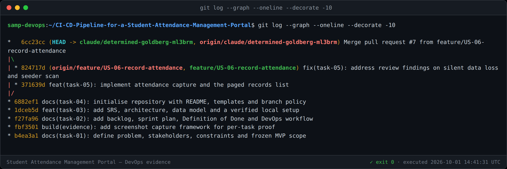
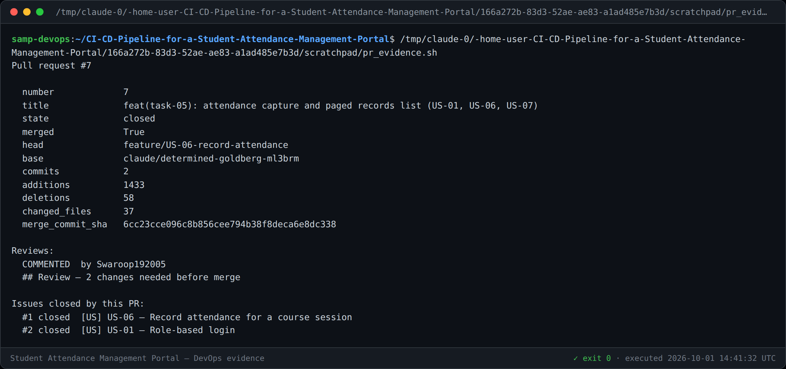
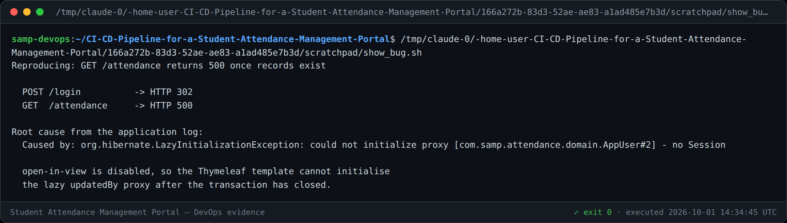

# Task 5 — Feature Development with Branching

**Feature:** Attendance capture and the paged records list (US-01, US-06, US-07)
**Branch:** `feature/US-06-record-attendance` → `claude/determined-goldberg-ml3brm`
**Pull request:** [#7](https://github.com/Swaroop192005/CI-CD-Pipeline-for-a-Student-Attendance-Management-Portal/pull/7) · **Merge commit:** `6cc23cc`
**Version:** 1.0

---

## 1. What was built

The first core workflow: a faculty member signs in, marks a full class in one
screen, and sees the result in a paged records list.

| Story | Capability |
|---|---|
| **US-01** | Role-based login with BCrypt-hashed credentials |
| **US-02** | Role restrictions for ADMIN / FACULTY / STUDENT |
| **US-06** | Record attendance for a course session |
| **US-07** | Paged records list, newest session first |

Issues [#1](https://github.com/Swaroop192005/CI-CD-Pipeline-for-a-Student-Attendance-Management-Portal/issues/1)
and [#2](https://github.com/Swaroop192005/CI-CD-Pipeline-for-a-Student-Attendance-Management-Portal/issues/2)
were closed by the merge.

### Design decisions

* **The state machine lives in `WorkflowState`.** `APPROVED` has an empty
  transition set, so it is terminal *by construction* rather than by an `if`
  somewhere. AC-14.1 requires an illegal transition to be refused, not hidden.
* **`unique(student, course, session_date)`** is what actually enforces AC-06.3.
  The service checks for existing records, but the database constraint is the
  guarantee.
* **A `SUBMITTED` or `APPROVED` record is never overwritten by a re-save.** The
  entry screen disables those rows and the service skips them (AC-08.2).

---

## 2. Git workflow demonstrated

```bash
git checkout -b feature/US-06-record-attendance    # branch from the integration branch
git add -A && git commit                            # feature commit
git push -u origin feature/US-06-record-attendance  # publish
#  → pull request #7 opened, reviewed, changes made, merged
git checkout claude/determined-goldberg-ml3brm
git pull origin claude/determined-goldberg-ml3brm   # merge commit 6cc23cc
```



The topology shows the branch diverging, two commits on it (the feature and the
review fixes), and the merge commit rejoining — the convention from
[CONTRIBUTING.md §3](../CONTRIBUTING.md#3-pull-requests) is a merge commit, not a
squash, precisely so this shape survives as evidence.



---

## 3. The review was real

The pull request received a review raising **two blocking findings and one note**.
Both blockers were fixed before merge in commit `824717d`.

### 🔴 Finding 1 — `DataSeeder` called `seeds.indexOf(s)` inside its own loop

```java
for (Seed s : seeds) {
    if (seeds.indexOf(s) < 5) { ... }   // O(n²), and matches on VALUE
}
```

`Seed` is a record, so `indexOf` compares by value, not identity: two equal
entries would have enrolled the wrong student. Replaced with an indexed loop, and
the bare `5` became `alsoEnrolledInCs302` with a stated purpose.

### 🔴 Finding 2 — a malformed form field was silently dropped

```java
} catch (IllegalArgumentException ignored) {
    // An unparseable field is skipped rather than failing the whole save.
}
```

Skipping the field left that student's attendance **unrecorded while the
confirmation still reported success**. That is exactly pain point P4 — the silent
edit — which this portal exists to eliminate. It now throws
`MalformedAttendanceFieldException` naming the offending field and value.

### 🟡 Note — not changed, deliberately

`saveSession` counts a re-save whose status did not change. Left as is: the
message answers "did my session save?", not "what changed?". Recorded so the
decision reads as a choice rather than an oversight.

> **On self-review.** GitHub refuses `REQUEST_CHANGES` on one's own pull request,
> so the review was submitted as a `COMMENT` with the blocking items marked. The
> findings are genuine — both changed the shipped code.

---

## 4. A defect found by running, not by testing

This is the most instructive part of the task.

**Symptom.** The records list rendered perfectly while empty, and returned
**HTTP 500 the moment it had rows.**



**Cause.** The view reads `updatedBy`. With `spring.jpa.open-in-view=false`, the
persistence context is closed before Thymeleaf runs, so that lazy proxy could no
longer be initialised:

```
org.hibernate.LazyInitializationException:
  could not initialize proxy [com.samp.attendance.domain.AppUser#2] - no Session
```

**Why every test passed.** `AttendanceServiceTest` is annotated `@Transactional`,
which keeps the persistence context open for the whole test. The tests were
exercising a world that does not exist at runtime.

**Fix.** `left join fetch r.updatedBy` with an explicit `countQuery`. Fetch-joining
a *to-one* association is safe with pagination; a to-many would not be, which is
why only this association is joined.

**The regression guard was verified to actually fail.** `AttendanceListRenderingTest`
renders the view outside a transaction, the way a real request does. Removing the
fetch join makes it fail with exactly this `LazyInitializationException`; restoring
it makes it pass. An unverified regression test is worthless.

This is the second defect in a row (after the H2 URL in Task 3) that a green test
suite did not catch. Both reinforce why Tasks 9-10 put a **Selenium gate in front
of deployment**: unit tests assert the code, but only driving the running
application asserts the product.

---

## 5. Evidence

| Screenshot | Shows |
|---|---|
| `01-login-page.png` | Login form (US-01) |
| `02-logged-in-empty-list.png` | Signed in as FACULTY, empty-state list |
| `03-roster-loaded.png` | **AC-06.1** — 8 enrolled students, all defaulting to PRESENT |
| `05-future-date-refused.png` | **AC-06.4** — future session date refused, nothing saved |
| `06-defect-lazy-init.png` | **The genuine HTTP 500** and its root cause |
| `07-saved-records-fixed.png` | **AC-06.2 / AC-07.1** — 8 DRAFT records with mixed statuses |
| `08-branch-merge-graph.png` | Branch, two commits, merge commit |
| `09-pull-request.png` | PR state, review, and the two issues it closed |
| `10-test-run.png` | 17 tests passing |

### Acceptance criteria coverage

| AC | Test |
|---|---|
| AC-01.3, AC-02.1, AC-02.2 | `AccessControlTest` (4 tests) |
| AC-06.1 | `rosterDefaultsToPresent` |
| AC-06.2 | `savingCreatesOneDraftRecordPerStudent` |
| AC-06.3 | `reSavingUpdatesRatherThanDuplicating`, `rosterReflectsExistingRecords` |
| AC-06.4 | `futureSessionDateIsRefused` |
| AC-07.1 | `AttendanceListRenderingTest` |
| AC-08.2 | `submittedRecordsAreNotOverwritten` |
| Workflow integrity | `stateMachinePermitsOnlyDefinedTransitions` |
| Review finding 2 | `malformedStatusFieldIsRejected` |

**17 tests, BUILD SUCCESS.**

---

## 6. Task 5 deliverable checklist

- [x] Working feature 1 — attendance capture and records list (§1)
- [x] Feature branch `feature/US-06-record-attendance` (§2)
- [x] `add` / `commit` / `push` / `pull` / `log` demonstrated (§2)
- [x] Pull request [#7](https://github.com/Swaroop192005/CI-CD-Pipeline-for-a-Student-Attendance-Management-Portal/pull/7) raised (§2)
- [x] Review comments — 2 blocking findings, both fixed before merge (§3)
- [x] Merge evidence — merge commit `6cc23cc` (§2)
- [x] Screenshot evidence in `docs/evidence/task-05/`
