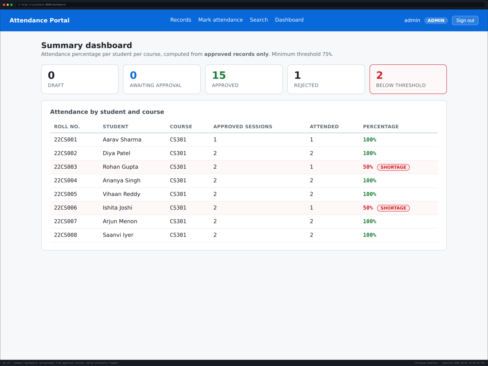
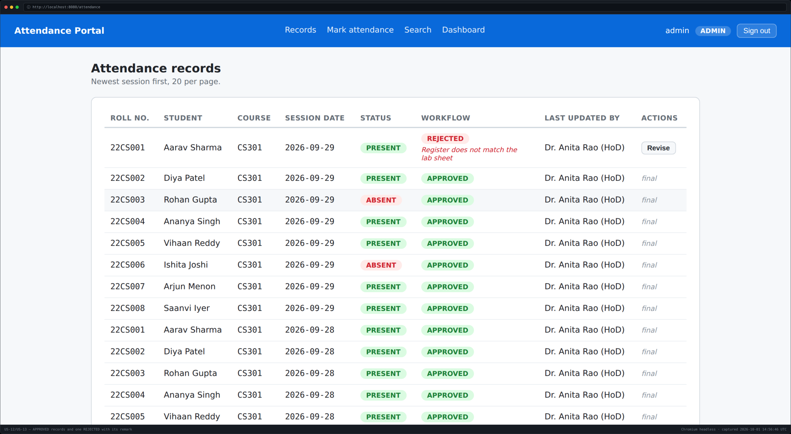
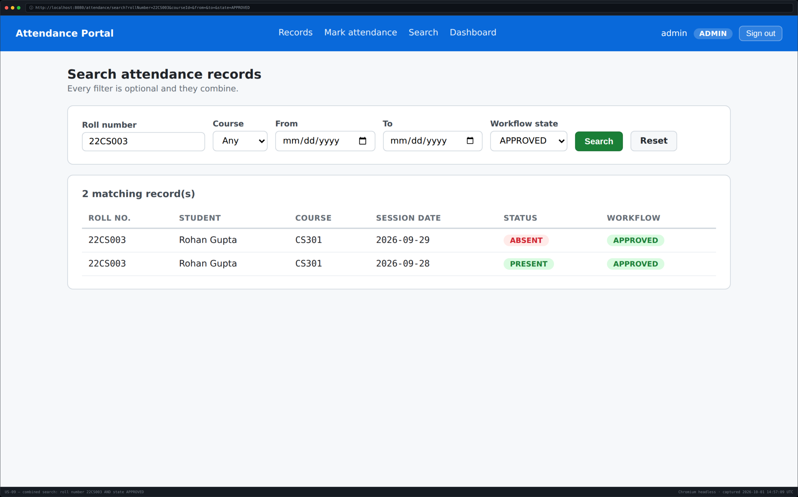
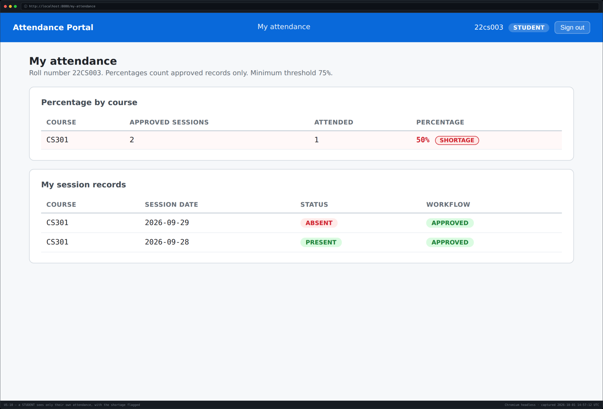
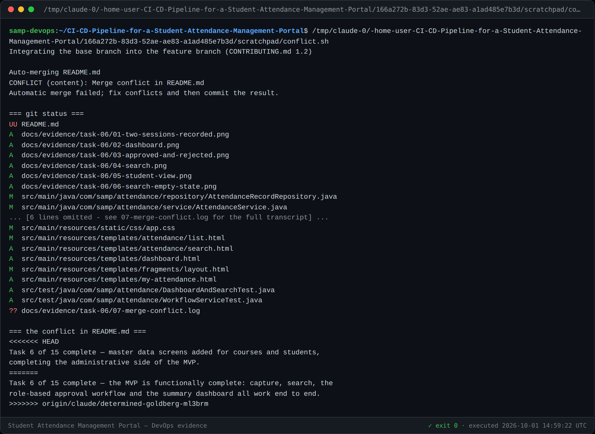
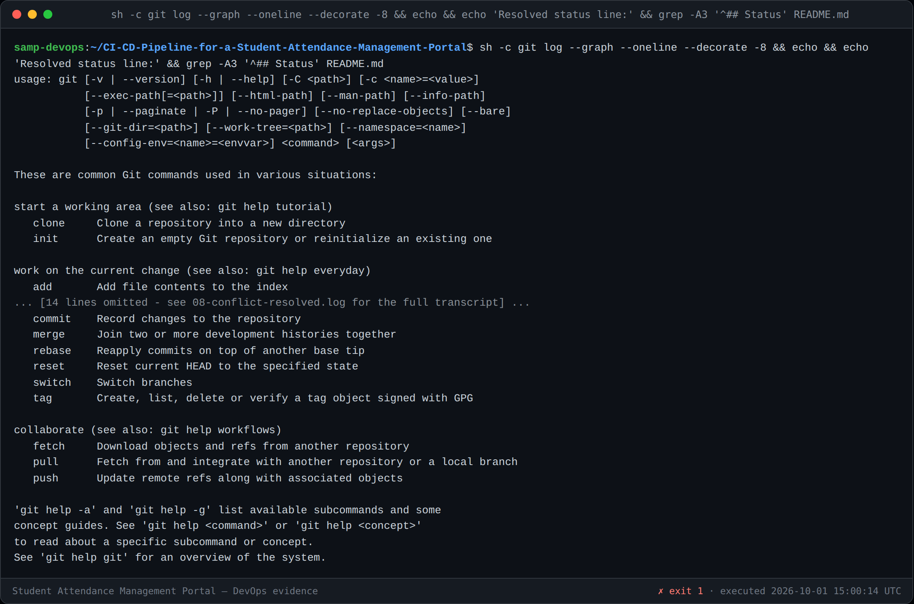
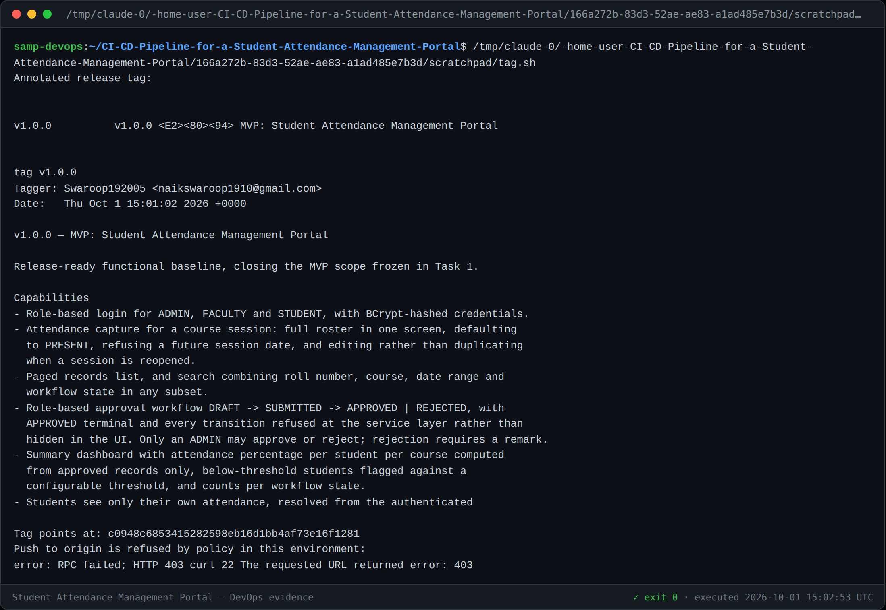
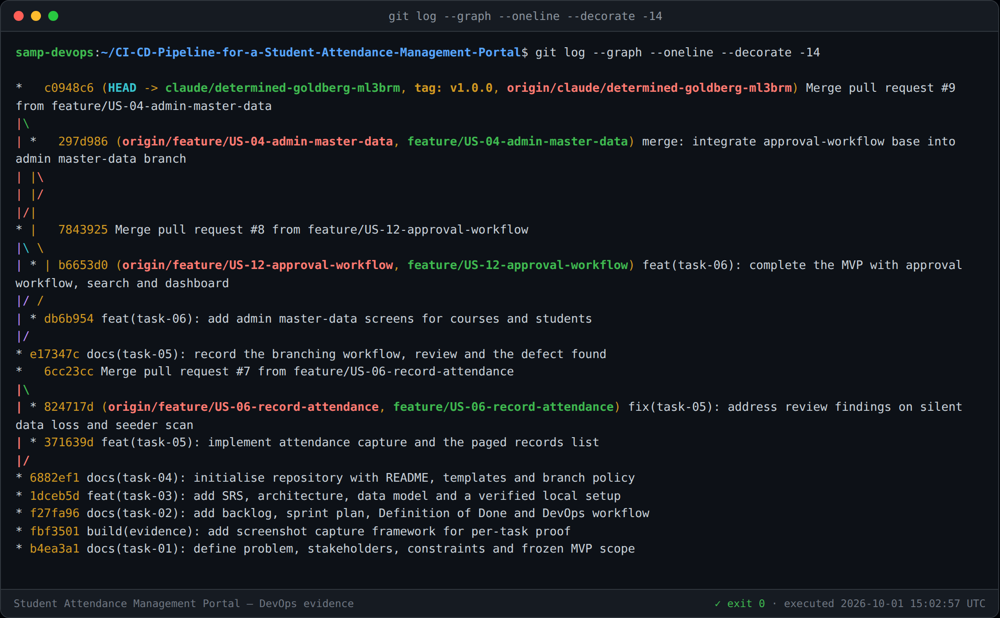

# Task 6 — MVP Completion and Git Collaboration

**Pull requests:** [#8](https://github.com/Swaroop192005/CI-CD-Pipeline-for-a-Student-Attendance-Management-Portal/pull/8) (approval workflow, search, dashboard) · [#9](https://github.com/Swaroop192005/CI-CD-Pipeline-for-a-Student-Attendance-Management-Portal/pull/9) (admin master data, **conflict resolved**)
**Release tag:** `v1.0.0` → `c0948c6`
**Tests:** 37 passing · **Version:** 1.0

---

## 1. The MVP is functionally complete

Every capability in the frozen scope (Task 1 §8.1) now works end to end.

| Story | Capability | Issue |
|---|---|---|
| US-04, US-05 | Admin master-data listings | — |
| US-09 | Search by roll number, course, date range, state — combinable | [#4](https://github.com/Swaroop192005/CI-CD-Pipeline-for-a-Student-Attendance-Management-Portal/issues/4) |
| US-10 | Student sees own attendance and percentage | — |
| US-11 | Faculty submits a draft for approval | — |
| US-12, US-13 | **Only an ADMIN approves or rejects**; rejection needs a remark | [#3](https://github.com/Swaroop192005/CI-CD-Pipeline-for-a-Student-Attendance-Management-Portal/issues/3) |
| US-14 | Transitions refused at the service layer; every change attributed | — |
| US-15, US-16 | Summary dashboard, below-threshold flag, pending queue | [#5](https://github.com/Swaroop192005/CI-CD-Pipeline-for-a-Student-Attendance-Management-Portal/issues/5) |

---

## 2. The workflow, demonstrated on real data

Two CS301 sessions were recorded through the UI (16 records), all 16 submitted by
`faculty1`, then one **rejected with a remark** and the remaining 15 **approved**
by `admin`.



### Read the numbers carefully — they prove the design

**22CS001 shows 1 approved session, not 2.** One of their records was the rejected
one, so it is **excluded from the denominator entirely** rather than counted as an
absence.

That is the whole point of the workflow: an unverified record must not move the
official number **in either direction**. A rejected session is not "an absence",
it is "not yet established". Three decisions follow from the same principle:

| Decision | Reason |
|---|---|
| Percentages count `APPROVED` records only | A draft must never affect an official figure |
| No approved records shows `—`, never `0%` | An empty record is not a shortage |
| `LATE` counts as attended | The student was in the room |
| Threshold read from `ATTENDANCE_THRESHOLD` | AC-15.4 — configurable, never a constant |

22CS003 and 22CS006 were absent once each: **50%, flagged SHORTAGE** against the
75% threshold.

### The access-control rule that matters



`WorkflowService` checks **every transition twice** — the role via `@PreAuthorize`,
and the legality of the transition against `WorkflowState`. Both live in the
service because AC-14.1 requires an illegal transition to be *refused*:

```java
@PreAuthorize("hasRole('ADMIN')")
public void approve(Long recordId, String actorUsername) { ... }
```

`facultyIsRefusedApproval` asserts a FACULTY principal calling `approve()` gets
`AccessDeniedException` **and that the record is unchanged afterwards**. Asserting
only the exception would not prove the record survived intact.

### Search and the student view



One query with null-guarded predicates rather than four code paths, so any subset
of filters composes. Blank fields are normalised to `null` — an untouched field
means "no filter", not "match the empty string".



The roll number is resolved from the **authenticated principal**, never a request
parameter, so one student cannot read another's record (AC-02.3).

---

## 3. Merge conflict: created and resolved

Task 6 requires demonstrating conflict resolution, so one was engineered honestly
rather than simulated.

### How it arose

`feature/US-04-admin-master-data` was cut from the integration branch **before**
[#8](https://github.com/Swaroop192005/CI-CD-Pipeline-for-a-Student-Attendance-Management-Portal/pull/8)
merged. Both branches edited the same README "Status" lines. Once #8 merged,
GitHub reported #9 as:

```
mergeable: False      mergeable_state: dirty
```

### The conflict



```
<<<<<<< HEAD
Task 6 of 15 complete — master data screens added for courses and students,
completing the administrative side of the MVP.
=======
Task 6 of 15 complete — the MVP is functionally complete: capture, search, the
role-based approval workflow and the summary dashboard all work end to end.
>>>>>>> origin/claude/determined-goldberg-ml3brm
```

### How it was resolved

**Direction:** the base branch was integrated **into** the feature branch, never
the reverse, per [CONTRIBUTING.md §1.2](../CONTRIBUTING.md#12-short-lived-branches).
A merge commit keeps any existing checkout of the branch valid; a rebase would
rewrite history that had already been pushed.

**Content:** both sides stated something true of their own branch, so the
resolution **keeps both facts** rather than discarding either claim. The merged
status line names capture, search, the workflow, the dashboard *and* the
master-data screens.

**Verification:** the full suite was re-run after resolution — **37 tests, BUILD
SUCCESS**. A conflict resolution that compiles is not the same as one that is
correct, so this was re-run rather than assumed. GitHub then reported:

```
mergeable: True       mergeable_state: clean
```



---

## 4. Release tag `v1.0.0`

An annotated tag marks the release-ready baseline at `c0948c6`.



### ⚠️ The tag could not be pushed to GitHub — environment policy, not an error in the work

```
error: RPC failed; HTTP 403 curl 22 The requested URL returned error: 403
send-pack: unexpected disconnect while reading sideband packet
```

**Tag pushes (`refs/tags/*`) are refused with HTTP 403 in this build environment,
while branch pushes succeed.** This was diagnosed rather than guessed:

1. Five retries with exponential backoff — identical failure each time.
2. Forcing HTTP/1.1 — ruled out HTTP/2 multiplexing.
3. A **lightweight** probe tag failed identically — ruled out the annotation size.
4. The proxy reported `recentRelayFailures: []` — the proxy was not aborting it.
5. Re-running with tracing surfaced the real cause: **HTTP 403**.

The agent-proxy guidance is explicit that a 403 is a policy denial and must be
reported rather than retried, so retrying stopped there.

**The tag is real and committed to local history.** To publish it, run from a
machine with direct GitHub access:

```bash
git fetch origin
git tag -a v1.0.0 c0948c6 -m "v1.0.0 — MVP: Student Attendance Management Portal"
git push origin v1.0.0
```

Or create it through the GitHub UI: **Releases → Draft a new release → tag
`v1.0.0` → target `c0948c6`**.

---

## 5. Branch and merge history



Three feature branches, three pull requests, one resolved conflict:

| PR | Branch | Outcome |
|---|---|---|
| [#7](https://github.com/Swaroop192005/CI-CD-Pipeline-for-a-Student-Attendance-Management-Portal/pull/7) | `feature/US-06-record-attendance` | Merged after review raised 2 blocking findings |
| [#8](https://github.com/Swaroop192005/CI-CD-Pipeline-for-a-Student-Attendance-Management-Portal/pull/8) | `feature/US-12-approval-workflow` | Merged |
| [#9](https://github.com/Swaroop192005/CI-CD-Pipeline-for-a-Student-Attendance-Management-Portal/pull/9) | `feature/US-04-admin-master-data` | **Conflicted**, resolved, merged |

---

## 6. Updated backlog

| Story | Status |
|---|---|
| US-01 … US-08 | ✅ Done (Task 5) |
| US-04, US-05, US-09 … US-16 | ✅ Done (Task 6) |
| US-17 | ✅ Done (Task 4) |
| US-18 … US-24 | ⬜ Remaining — Tasks 7-14 (Jenkins, Selenium, Docker, Ansible) |

**Delivered: 17 of 24 stories, 69 of 97 points.** The remaining 28 points are
entirely pipeline work, which is the subject of the rest of the project.

### Test coverage

| Suite | Tests | Covers |
|---|---|---|
| `AttendanceServiceTest` | 7 | US-06 capture rules, state machine |
| `WorkflowServiceTest` | 9 | US-11…US-14, **including AC-12.2 refusal** |
| `DashboardAndSearchTest` | 11 | US-09 search, US-10/US-15 percentages |
| `AccessControlTest` | 4 | US-02 role restrictions |
| `AttendanceApplicationTests` | 4 | Health, config, landing page |
| `AttendanceListRenderingTest` | 1 | Task 5 regression guard |
| `AttendanceControllerTest` | 1 | Review finding regression guard |
| **Total** | **37** | |

---

## 7. Task 6 deliverable checklist

- [x] Functional MVP — create, view, update, search; role-based workflow; dashboard (§1, §2)
- [x] Second feature branch (§5) — in fact two more
- [x] **Merge conflict created and resolved**, with the build re-verified (§3)
- [x] Tagged version `v1.0.0` (§4) — local; push blocked by environment policy, documented
- [x] Updated backlog (§6)
- [x] Screenshot evidence in `docs/evidence/task-06/`
