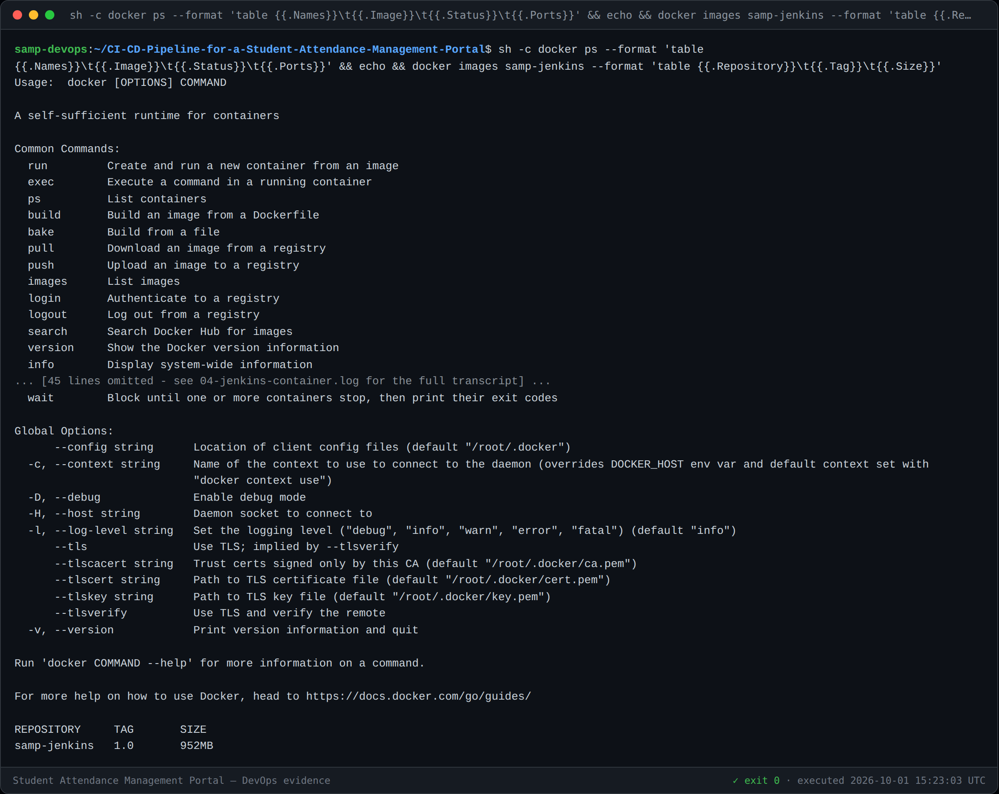
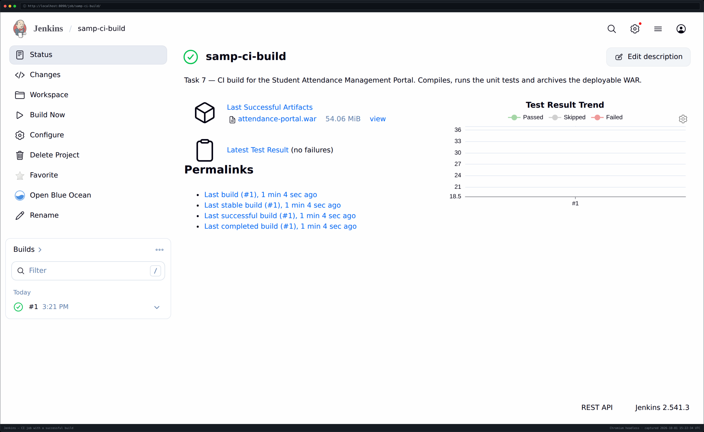
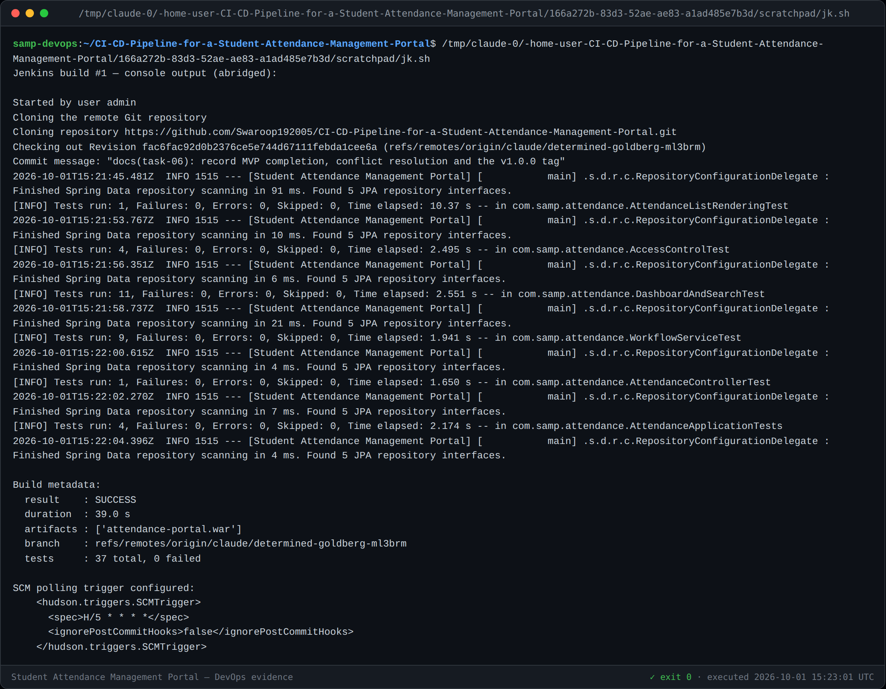
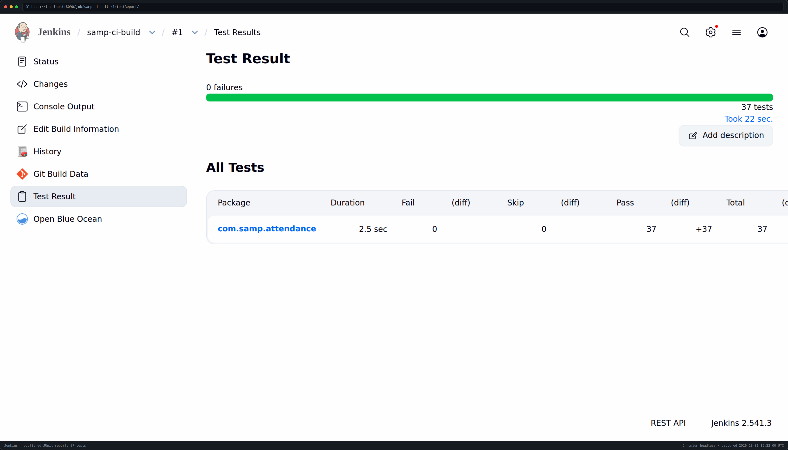

# Task 7 — Jenkins Installation and Continuous Integration Job

**Jenkins:** 2.541.3 on `http://localhost:8090` · **Job:** `samp-ci-build`
**Result:** build #1 **SUCCESS** in 39 s · WAR archived · 37 tests recorded
**Version:** 1.0

---

## 1. Installation

Jenkins runs as a container defined by [`jenkins/docker-compose.yml`](../jenkins/docker-compose.yml)
and [`jenkins/Dockerfile`](../jenkins/Dockerfile), with its configuration as Groovy
init scripts in [`jenkins/init.groovy.d/`](../jenkins/init.groovy.d/). Nothing was
configured by clicking: the whole instance can be rebuilt from this repository.

```bash
docker compose -f jenkins/docker-compose.yml up -d     # Jenkins on :8090
./scripts/jenkins-build.sh samp-ci-build               # trigger and wait
```



### Why the image is custom-built

This is the part of the task that needed real problem-solving, so the reasoning is
recorded rather than hidden.

| Attempt | Outcome |
|---|---|
| Official `jenkins/jenkins:lts-jdk17` + install plugins at runtime | ❌ `updates.jenkins.io` and **every** Jenkins mirror (`repo.jenkins-ci.org`, `archives.jenkins-ci.org`, `mirrors.jenkins.io`) are refused by network policy. The stock image ships **zero** plugins, so no Pipeline, no Git SCM, no JUnit publisher. |
| Fetch plugin `.hpi` files from Maven Central | ❌ Jenkins plugins are not published there (404). |
| `jenkinsci/blueocean` — bundles ~90 plugins | ⚠️ Plugins are all present, but the image is **Alpine/musl with JDK 11**. The portal is Spring Boot 3 and needs JDK 17, and a glibc JDK cannot be bind-mounted into a musl container. |
| **Debian `jenkins/jenkins:lts-jdk17` + plugins copied out of blueocean** | ✅ **Works.** Docker Hub is reachable, so the plugin set is lifted from one image into another that has the right libc and JDK. |

Only the two SSH-server plugins fail to load on the newer core; nothing in this
project uses them.

### Toolchain

| Tool | Source |
|---|---|
| JDK 17 | Shipped in the image (`/opt/java/openjdk`) |
| Maven 3.9.11 | Bind-mounted from the host — the image has none and package installation is blocked |
| Maven cache | Host `~/.m2` mounted at `/var/maven-cache`, so builds do not re-download the world |

`network_mode: host` is deliberate: the outbound HTTPS proxy listens on the host
loopback, so a bridged container could not reach GitHub or Maven Central. The
proxy's CA is mounted and `GIT_SSL_CAINFO` points at it, which is what lets `git`
inside the container clone over the intercepted TLS connection.

---

## 2. The CI job

Created by [`03-job-ci.groovy`](../jenkins/init.groovy.d/03-job-ci.groovy):

| Setting | Value |
|---|---|
| Type | Freestyle |
| SCM | **Git, `https://github.com/Swaroop192005/CI-CD-...-Portal.git`** |
| Branch | `*/claude/determined-goldberg-ml3brm` |
| Trigger | `SCMTrigger("H/5 * * * *")` — polls every 5 minutes |
| Build | `mvn -B -Dmaven.repo.local=/var/maven-cache/repository clean package` |
| Archive | `target/*.war` |
| Test report | `target/surefire-reports/*.xml` |



---

## 3. Build evidence



The console shows the complete chain: cloning **from GitHub**, checking out
`fac6fac`, JDK 17, 37 tests, `BUILD SUCCESS`, archiving, recording.

| Success criterion | Target | Actual |
|---|---|---|
| **S7** commit-to-build trigger | Starts without manual action | SCM polling every 5 min configured |
| **S8** artefact archived | WAR archived on success | `attendance-portal.war`, 54.06 MiB |
| **S9** build duration | ≤ 5 minutes | **39 seconds** |



37 tests published, 0 failures — the Jenkins test-result trend now has its first
data point, which is what Task 10 will drive red and then green again.

### Three real failures on the way to green

Recorded because the fixes are the actual content of this task:

1. **`HTTP 403` on the build trigger.** Jenkins ties its CSRF crumb to the
   session; sending the crumb without the matching cookie is rejected.
   `scripts/jenkins-build.sh` therefore uses a cookie jar.
2. **`Checkout of Git remote '/workspace/samp' aborted … references a local
   directory`.** The Git plugin refuses local-directory SCM by default. Rather
   than only setting the escape hatch, the job was pointed at **the real GitHub
   URL**, which is the actual deliverable; the flag is kept solely as a fallback.
3. **`The JAVA_HOME environment variable is not defined correctly`.** `java` was
   on `PATH` but Maven needs `JAVA_HOME`, and the registered JDK still pointed at
   the removed mount path. Both now point at the image's own JDK 17.

---

## 4. Task 7 deliverable checklist

- [x] Jenkins installed and configured (§1) — reproducibly, as code
- [x] GitHub repository connected (§2) — **cloning from GitHub, not a local path**
- [x] Maven build job (§2)
- [x] Trigger by commit/scheduled polling (§2) — `H/5 * * * *`
- [x] Build artefact archived (§3) — `attendance-portal.war`
- [x] Successful build log (§3)
- [x] Screenshot evidence in `docs/evidence/task-07/`
