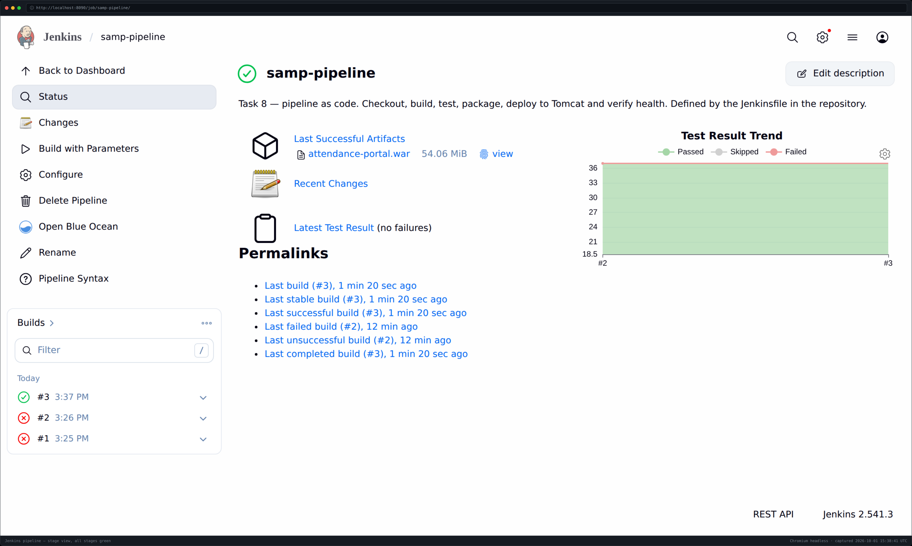
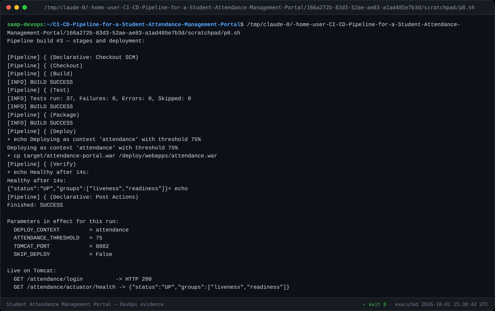
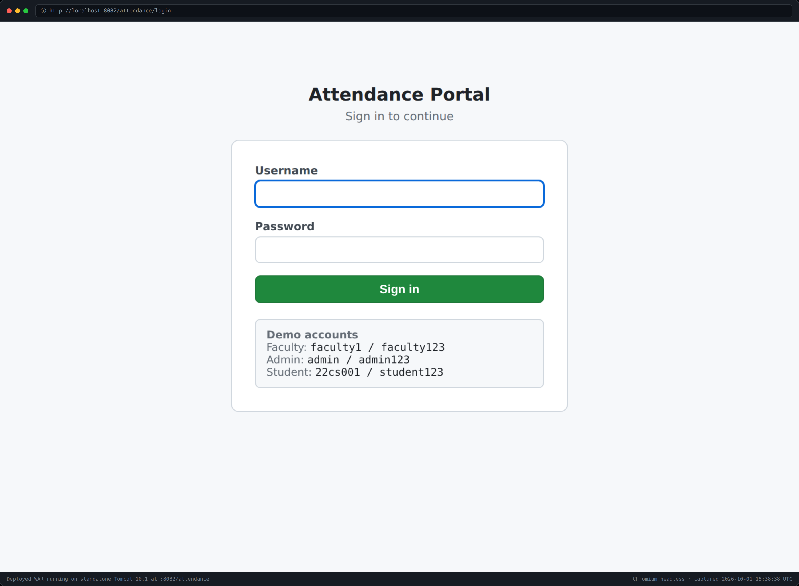

# Task 8 — Pipeline as Code and Server Deployment

**Pipeline:** [`Jenkinsfile`](../Jenkinsfile) → Jenkins job `samp-pipeline`
**Deployed to:** Apache Tomcat 10.1 container at **http://localhost:8082/attendance**
**Build #3:** SUCCESS — all stages green, health verified
**Version:** 1.0

---

## 1. Pipeline as code

The whole pipeline lives in [`Jenkinsfile`](../Jenkinsfile) at the repository root,
so it is versioned and reviewed with the application it builds (US-19, S10).

| Stage | Does |
|---|---|
| **Checkout** | `checkout scm` from GitHub, logs the commit being built |
| **Build** | `mvn clean compile` |
| **Test** | `mvn test`, publishes the JUnit report |
| **Package** | `mvn package`, archives `target/*.war` with a fingerprint |
| **Deploy** | Copies the WAR into the Tomcat `webapps` directory |
| **Verify** | Polls `/actuator/health` on the deployed context, fails if unhealthy |



### Three deliberate choices

1. **The Test stage publishes its report in `post { always }`, not on success.**
   A failed run must still publish, otherwise the Task 10 quality gate would have
   nothing to show for a red build.
2. **Deploy and Verify sit after Test and are guarded by `when`.** A failing test
   therefore leaves them *unexecuted* rather than executed-and-failed. That
   ordering is exactly what Task 10 proves.
3. **Verify polls the real health endpoint** and fails the build after 60 s. A
   deployment that silently did not start cannot be reported as success.

`timestamps()` is deliberately absent — it needs the `timestamper` plugin, which
this environment cannot install. The reason is written into the file so it is not
mistaken for an oversight.

---

## 2. Parameterisation

Four parameters, so one pipeline serves more than one environment with no edit
(AC-19.2):

| Parameter | Default | Purpose |
|---|---|---|
| `DEPLOY_CONTEXT` | `attendance` | Tomcat context path — the WAR deploys as `<context>.war` |
| **`ATTENDANCE_THRESHOLD`** | `75` | **The business rule itself**, changeable with no rebuild |
| `TOMCAT_PORT` | `8082` | Port the verification stage probes |
| `SKIP_DEPLOY` | `false` | Build and test only, without touching the server |



The console confirms the parameters resolved:
`Deploying as context 'attendance' with threshold 75%`.

---

## 3. Deployment

The pipeline deploys to a **real standalone Tomcat 10.1**, not an embedded one —
the same WAR, in the container the brief requires (constraint C2).

```
Jenkins container ──writes──> ./deploy/webapps ──mounted──> Tomcat container
                                 attendance.war              auto-deploy
```

The `webapps` directory is a volume shared between the two containers. This gives
a genuine server deployment **without putting a Docker socket inside Jenkins**,
which would have handed the build full control of the host's container runtime
for no benefit.

The deploy stage removes the previously exploded directory before copying, so
Tomcat redeploys cleanly rather than serving a stale mix of old and new classes.



### Verified live

```
GET /attendance/login           -> HTTP 200
GET /attendance/actuator/health -> {"status":"UP","groups":["liveness","readiness"]}
Healthy after 14s
```

---

## 4. Two Jenkins behaviours worth recording

Both cost a build and are easy to misdiagnose:

1. **`HTTP 400` when triggering.** Once a pipeline declares `parameters`, the job
   becomes parameterised and `POST /job/<name>/build` is rejected — it must be
   `POST /job/<name>/buildWithParameters`. `scripts/jenkins-build.sh` now uses
   that, with a fallback for the unparameterised freestyle job.
2. **Parameters are empty on the very first run.** Jenkins only learns a
   pipeline's parameter definitions by *running* the Jenkinsfile once, so run #2
   printed `context '' with threshold %`. This is expected Jenkins behaviour, not
   a bug in the pipeline: from run #3 onward the defaults apply.

The helper script also had a real bug of its own — it polled `lastBuild` and so
reported the *previous* build's result in the window before the new build was
queued. It now records the build number before triggering and waits for a higher
one.

---

## 5. Task 8 deliverable checklist

- [x] `Jenkinsfile` with checkout, build, package and deploy stages (§1)
- [x] Successful pipeline run (§1, §3) — build #3, all stages green
- [x] Deployed application URL (§3) — http://localhost:8082/attendance
- [x] At least one environment setting parameterised (§2) — four of them
- [x] Screenshot evidence in `docs/evidence/task-08/`
