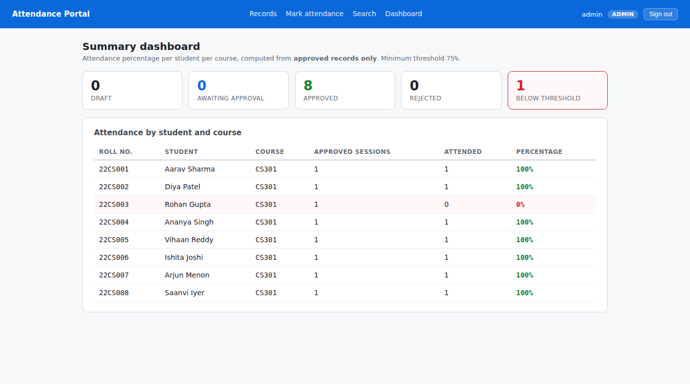
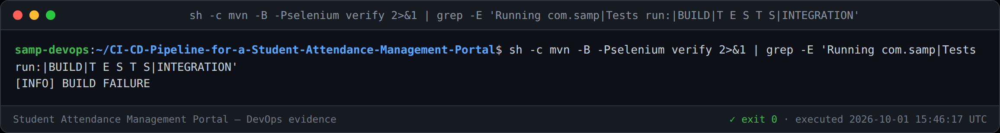

# Task 9 — Selenium Test Design and Local Execution

**Suite:** `src/test/java/com/samp/attendance/selenium/` · **6 journeys**
**Run:** `mvn -Pselenium verify` → **43 tests pass** (37 unit + 6 journeys) in ~19 s
**Version:** 1.0

---

## 1. Test plan — the six critical journeys

A journey earns a place here only if its breakage would make the portal useless.
That is the bar for gating deployment on it.

| # | Journey | Why it is critical | Asserts |
|---|---|---|---|
| **J1** | Faculty signs in and records a full session | The core value of the product | Role badge, 8-student roster, PRESENT default, "Attendance saved for 8 students", 8 rows listed |
| **J2** | A future session date is refused | Prevents fabricated attendance | Error message shown **and** nothing persisted |
| **J3** | Records found by search | Answering a query is the point of digitising | Exact match by roll number, and the empty state for no matches |
| **J4** | Approval workflow | Separation of duties — the integrity of the data | Faculty submits 8; **faculty is offered no approve control**; admin approves 8 |
| **J5** | Dashboard flags a shortage | The number students are judged on | 75% threshold, 8 approved, 0% for the absentee, exactly 1 row flagged |
| **J6** | Student sees only their own record | Privacy and access control | Own roll number, own percentage, shortage visible, **entry screen unreachable** |

### Test data

Stated as constants at the top of the suite so a reader can check every
assertion against it:

| Role | Credentials |
|---|---|
| Faculty | `faculty1` / `faculty123` |
| Admin | `admin` / `admin123` |
| Student | `22cs003` / `student123` |

The seeded dataset (8 students, CS301/CS302) is fixed, which is what makes the
assertions exact — "exactly 1 row flagged" is only meaningful against known data.

---

## 2. Design decisions that keep the gate trustworthy

A gate that fails at random is worse than no gate, because the team learns to
re-run it instead of reading it. Three rules follow from that:

1. **No `Thread.sleep` anywhere.** Every wait is an explicit `WebDriverWait`
   condition. Fixed sleeps are the single largest source of flaky UI tests (risk R1).
2. **Selectors are `data-testid` only** — never CSS classes or text positions, so
   restyling the portal cannot break the suite.
3. **The app starts in-process** on a random port via `@SpringBootTest`, so the
   suite cannot accidentally pass against a stale deployment, and needs no
   externally running server.

The journeys are **ordered** (`@TestMethodOrder`): J4 and J5 need the data J1
creates. That ordering is itself the realistic path a user takes through the
product, and it tests more than six independently re-seeded journeys would.

---

## 3. Failure screenshot mechanism

`ScreenshotOnFailure` captures, **for failures only**, three artefacts:

| Artefact | Answers |
|---|---|
| `.png` | What the user would have seen |
| `.html` | The DOM — e.g. whether an element was present but not *visible* |
| `.txt` | Test name, URL at failure, and the assertion error |

### The detail that makes it work

The extension implements **`AfterTestExecutionCallback`, not `TestWatcher`.**

That distinction is the whole mechanism. `AfterTestExecutionCallback` runs
immediately after the test body and **before** any `@AfterEach` method, so the
browser is still alive. `TestWatcher` fires *after* `@AfterEach` has already
called `driver.quit()` — by which point there is nothing left to photograph.

The first version of this class used `TestWatcher` and **silently captured
nothing** while reporting failures normally. It was only caught by checking that
the output directory actually contained files, which is why the rule in
`docs/evidence/README.md` exists: a mechanism is not verified until its output is
inspected.

### Demonstrated on a real failure



Produced by removing the SHORTAGE flag from `dashboard.html` and running the
suite. 22CS003 is visibly at **0%** with the row tinted, yet the **badge is
gone** — a reviewer can identify the defect from the image without reading a
stack trace. The defect was reverted immediately afterwards.

---

## 4. Local execution through Maven

```bash
mvn -Pselenium verify
```



The journeys live in a **`selenium` Maven profile** bound to `failsafe`, not
`surefire`:

* Ordinary `mvn package` stays fast — unit tests only — so compile-time feedback
  is not slowed by a browser.
* `failsafe` runs in `integration-test`/`verify`, and still produces its report
  when tests fail, which is what Task 10's gate depends on.

### Toolchain, and a version problem worth recording

The container ships **Chromium 141** and **ChromeDriver 147**. ChromeDriver
enforces a matching major version, so the bundled pair cannot work together.
`googlechromelabs.github.io` is blocked by network policy, but
`storage.googleapis.com` is reachable, so the exactly matching driver was
fetched directly:

```
https://storage.googleapis.com/chrome-for-testing-public/141.0.7390.37/linux64/chromedriver-linux64.zip
```

Driver and browser paths are Maven properties, so nothing is hard-coded in the
tests and CI can override them.

---

## 5. Three real defects found while writing the suite

| Defect | Cause |
|---|---|
| Screenshots silently never written | `TestWatcher` fires after `driver.quit()` (§3) |
| `Node with given id does not belong to the document` | An element list held across a navigation goes stale; the loop now re-finds each iteration and tolerates `StaleElementReferenceException` |
| Admin half of J4 ran as the faculty user | `GET /logout` does nothing — Spring Security accepts logout only as POST, so the session survived. `signOut()` now clears cookies |

The third is the most instructive: the test was *passing the wrong thing*
rather than failing, which is the failure mode a UI suite is most prone to.

---

## 6. Task 9 deliverable checklist

- [x] Test plan — 6 critical journeys with rationale (§1)
- [x] Selenium scripts with assertions (§1) — `CriticalJourneysIT`
- [x] Test data stated explicitly (§1)
- [x] Screenshot mechanism for failures (§3) — **demonstrated on a real failure**
- [x] Local test report via Maven (§4) — 43 tests, BUILD SUCCESS
- [x] Screenshot evidence in `docs/evidence/task-09/`
