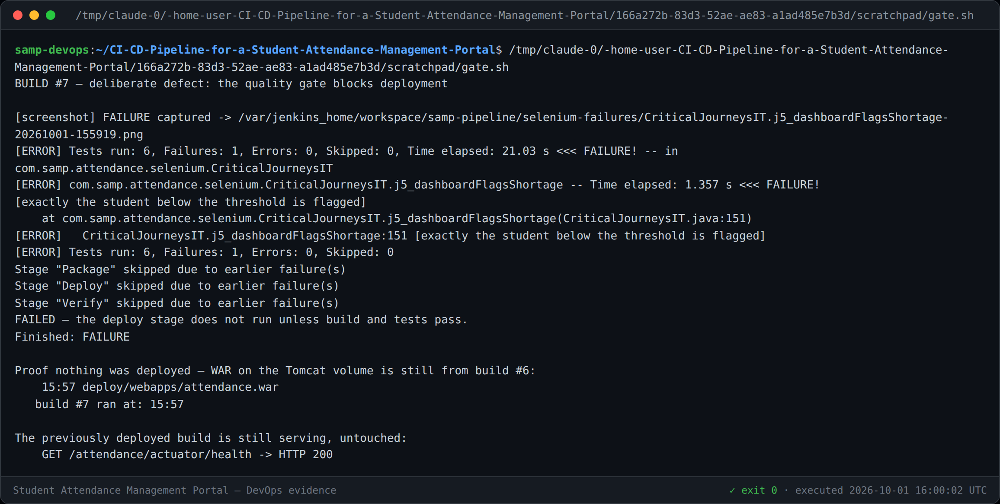
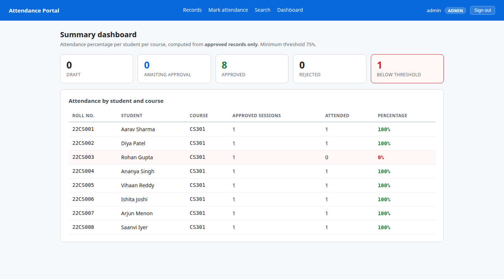
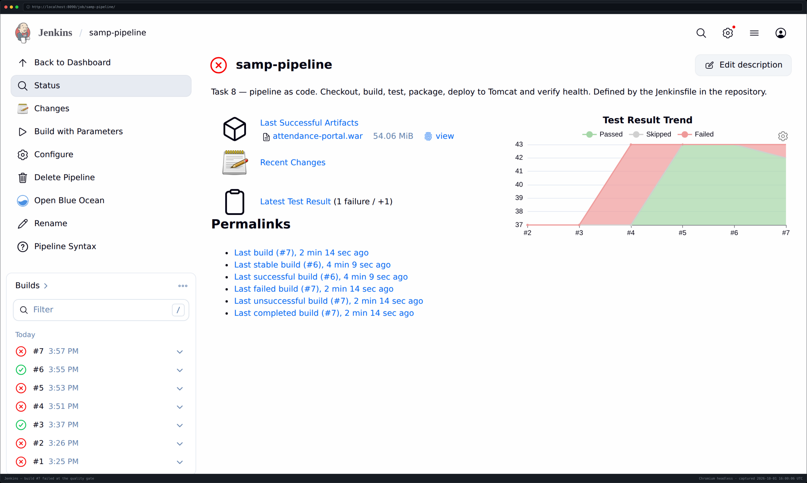
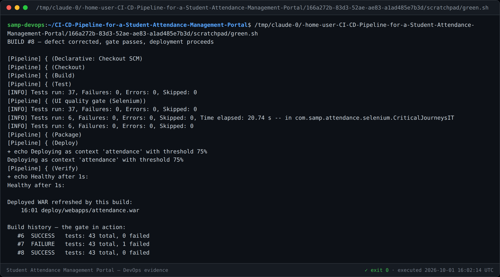
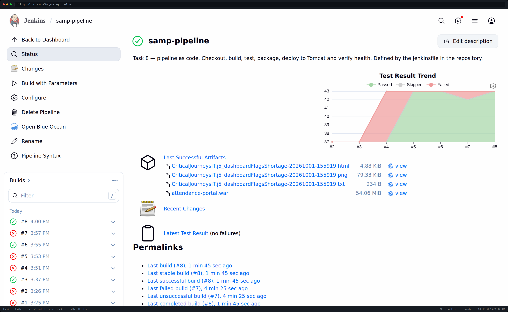

# Task 10 — Continuous Testing in Jenkins

**Gate:** Selenium stage between Test and Package in the [`Jenkinsfile`](../Jenkinsfile)
**Proof:** build **#7 red → Deploy skipped**, defect corrected, build **#8 green → deployed**
**Version:** 1.0

---

## 1. The Selenium suite runs in Jenkins

A stage named *UI quality gate (Selenium)* runs the six journeys, publishes the
failsafe report and archives any failure screenshots.

```groovy
stage('UI quality gate (Selenium)') {
    steps { sh 'mvn -B $MAVEN_OPTS -Pselenium verify -Dselenium.remote.url=${SELENIUM_URL} ...' }
    post {
        always {
            junit testResults: 'target/failsafe-reports/*.xml', allowEmptyResults: true
            archiveArtifacts artifacts: 'selenium-failures/**', allowEmptyArchive: true
        }
    }
}
```

### Why the browser runs in its own container

The Jenkins image has neither Chrome nor its shared libraries
(`libglib-2.0.so.0` and friends), and `deb.debian.org` returns **403** here, so
they cannot be installed. The browser therefore runs in a separate
`selenium/standalone-chrome` container and the tests drive it over the Grid
protocol.

That constraint pushed the design to the **canonical** architecture rather than a
worse one: tests and browser are decoupled, and the same suite runs unchanged
locally (local ChromeDriver) and in CI (`RemoteWebDriver`), selected by the single
`selenium.remote.url` property. Both containers use host networking so the remote
browser can reach the application on whatever random port the test context binds.

---

## 2. The gate blocks deployment — demonstrated, not asserted

A screenshot of a passing build proves nothing about a gate. The only proof is
showing it **block** something.

### The deliberate defect (commit `848d3b2`)

The SHORTAGE badge was removed from `dashboard.html`, so students below the
attendance threshold are silently no longer flagged.

This defect was chosen deliberately: **the page still renders, the percentages are
still correct, and nothing throws.** Unit tests pass. A reviewer skimming the diff
could easily miss it. Only a journey that looks at the rendered dashboard catches
it — which is the entire argument for a UI gate in front of deployment.

### Build #7 — red



```
[ERROR] CriticalJourneysIT.j5_dashboardFlagsShortage:151 [exactly the student below the threshold is flagged]
[screenshot] FAILURE captured -> .../j5_dashboardFlagsShortage-20261001-155919.png

Stage "Package" skipped due to earlier failure(s)
Stage "Deploy"  skipped due to earlier failure(s)
Stage "Verify"  skipped due to earlier failure(s)
```

**Success criterion S11 is met:** the deploy stage was *not executed*. Not
executed-and-rolled-back — never run at all.

Two independent confirmations that nothing reached the server:

| Check | Result |
|---|---|
| WAR timestamp on the Tomcat volume | still build #6's, while #7 ran two minutes later |
| Previously deployed build | still serving, `HTTP 200`, untouched |

The build also carried its own diagnosis: the failure screenshot was archived
against it.





### The correction (commit `9f6ac8b`) and build #8 — green



With the flag restored, the gate passes, Deploy runs, and Verify reports
`Healthy after 1s`. The WAR on the Tomcat volume is refreshed by this build.



| Build | Result | Tests | Deploy |
|---|---|---|---|
| #6 | SUCCESS | 43 total, 0 failed | ✅ deployed |
| **#7** | **FAILURE** | **43 total, 1 failed** | ❌ **skipped** |
| #8 | SUCCESS | 43 total, 0 failed | ✅ deployed |

That three-row history *is* the deliverable: detect → block → fix → re-verify.

---

## 3. Two real defects fixed to get the pipeline working

Both are recorded because each cost a build and neither is obvious.

### Build #5 — `rm: cannot remove '/deploy/webapps/attendance': Permission denied`

The deploy stage tried to delete Tomcat's exploded directory first. Tomcat
creates it as **root with mode 750**, and Jenkins runs as uid 1000, so the delete
failed.

The deletion was unnecessary in the first place — Tomcat replaces that directory
itself when it sees a newer WAR. The fix removed the `rm` entirely.

### The same stage — a latent race worth fixing before it bit

The WAR is 55 MB and Tomcat's `autoDeploy` scanner watches the directory, so a
plain `cp` can be picked up **mid-copy** and deploy a truncated archive. The stage
now copies to a `.tmp` name and `mv`s it into place: the rename is atomic within
the filesystem, and the scanner matches only `*.war` so it ignores the temp file.

This had not yet caused a visible failure. It was fixed because an intermittent
"sometimes the deploy is corrupt" bug is far more expensive to diagnose later than
to prevent now.

---

## 4. Success criteria

| ID | Criterion | Evidence |
|---|---|---|
| **S11** | A failing test leaves deploy **not executed** | Build #7 — `Stage "Deploy" skipped due to earlier failure(s)` |
| **S12** | Defect caught, fixed, pipeline green again | #7 red → `9f6ac8b` → #8 green |
| AC-21.2 | Test results published in Jenkins | 43 tests per build in the trend |
| AC-20.2 | Failing test captures a screenshot | Archived against build #7 |

---

## 5. Task 10 deliverable checklist

- [x] Selenium suite integrated into Jenkins (§1)
- [x] Test reports published (§1) — 43 tests per build
- [x] Failed tests stop deployment (§2) — **demonstrated on build #7**
- [x] Deliberately introduced defect corrected (§2) — `848d3b2` → `9f6ac8b`
- [x] Successful rerun (§2) — build #8
- [x] Screenshot evidence in `docs/evidence/task-10/`
