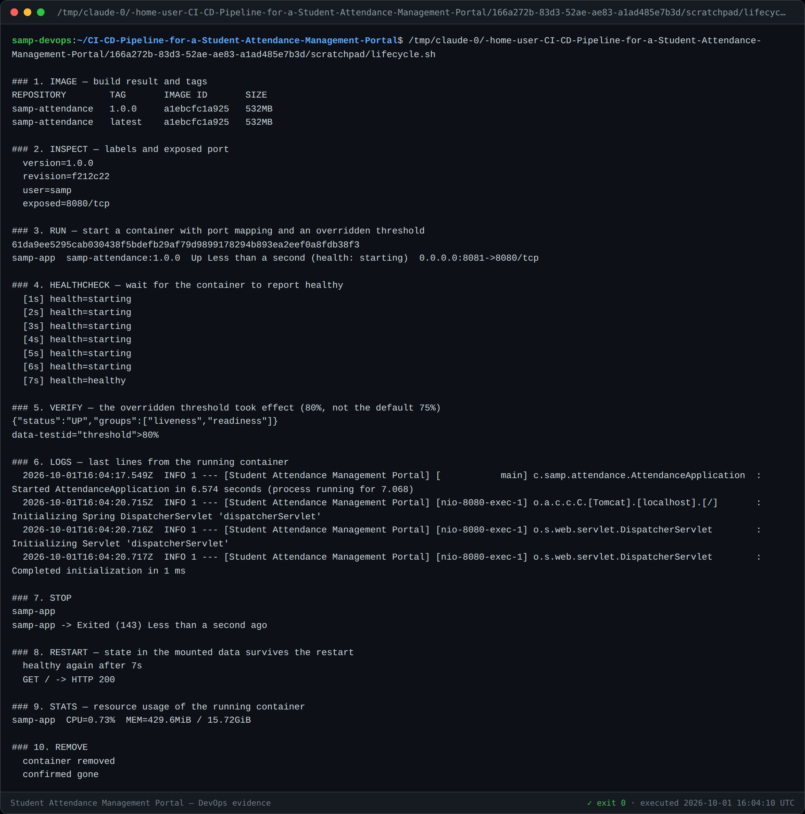

# Task 11 — Docker Image and Container Lifecycle

**Image:** `samp-attendance:1.0.0` (also tagged `latest`) · **Base:** `eclipse-temurin:17-jre`
**Verified:** healthy in **7 s**, config override effective, restart recovered, removal confirmed
**Version:** 1.0

---

## 1. The Dockerfile

[`Dockerfile`](../Dockerfile) — the decisions worth defending:

| Decision | Reason |
|---|---|
| **Single stage, not multi-stage** | A multi-stage build running Maven inside Docker would re-resolve every dependency through the daemon — duplicating work the pipeline already did, and needing network the build context may not have. The pipeline builds the WAR once and this image packages **that exact artefact**, so the thing tested is the thing shipped. |
| **Runs as non-root (`samp`, uid 1001)** | A servlet container has no need for root. A breakout costs far less when the process owns nothing. |
| **`HEALTHCHECK` hits `/actuator/health`** | The *same* endpoint the pipeline and Ansible probe, so "healthy" means one thing across the project rather than three. |
| **Every setting an `ENV` with a default** | Port, datasource and threshold are overridable with `-e`, so one image serves every environment (NFR-09). |
| **`.dockerignore` allows only the WAR** | Keeps the build context small and stops local state — the H2 database, the evidence pack, the Jenkins volume — from being shipped to the daemon or baked into a layer. |

```dockerfile
HEALTHCHECK --interval=15s --timeout=4s --start-period=45s --retries=4 \
  CMD curl -fsS "http://localhost:${SERVER_PORT}/actuator/health" | grep -q '"status":"UP"' || exit 1
```

The check greps for `"status":"UP"` rather than trusting the HTTP code alone: an
actuator can answer 200 while reporting `DOWN`, and a container that is *running
but broken* is worse than one that is plainly dead, because nothing restarts it.

---

## 2. Complete container lifecycle

Every step below was executed for real; the log is committed beside the image.



| # | Step | Result |
|---|---|---|
| 1 | **Build & tag** | `samp-attendance:1.0.0` and `:latest` |
| 2 | **Inspect** | `version=1.0.0`, `revision=<commit>`, **`user=samp`**, `exposed=8080/tcp` |
| 3 | **Run** with port mapping `8081:8080` and `-e ATTENDANCE_THRESHOLD=80` | started |
| 4 | **Health** | `healthy` after **7 s** — well inside the 60 s target (S13) |
| 5 | **Verify config override** | page renders **`80%`**, not the built-in default of 75% |
| 6 | **Logs** | `docker logs --tail 4` |
| 7 | **Stop** | `Exited (143)` |
| 8 | **Restart** | healthy again after **7 s**, `GET / → HTTP 200` |
| 9 | **Stats** | CPU and memory of the running container |
| 10 | **Remove** | confirmed gone |

### Step 5 is the one that matters

The container was started with `-e ATTENDANCE_THRESHOLD=80` and the running
application rendered **80%**. That single line proves the image is genuinely
environment-agnostic: the business rule changed with **no rebuild and no new
image**, which is what makes one artefact promotable from dev to production.

### Port map

Per the map fixed in Task 3 to avoid collisions (risk R5):

| Port | Service |
|---|---|
| 8080 | Local development |
| **8081** | **This container** |
| 8082 | Standalone Tomcat (Task 8) |
| 8090 | Jenkins |
| 4444 | Selenium Grid |

---

## 3. Task 11 deliverable checklist

- [x] `Dockerfile` (§1)
- [x] Image built and tagged (§2) — `1.0.0` and `latest`
- [x] Image details — labels, user, exposed port (§2)
- [x] Container run with port mapping (§2)
- [x] Logs inspected (§2)
- [x] Stop / restart / remove (§2)
- [x] Complete lifecycle documented (§2)
- [x] Running container evidence in `docs/evidence/task-11/`
