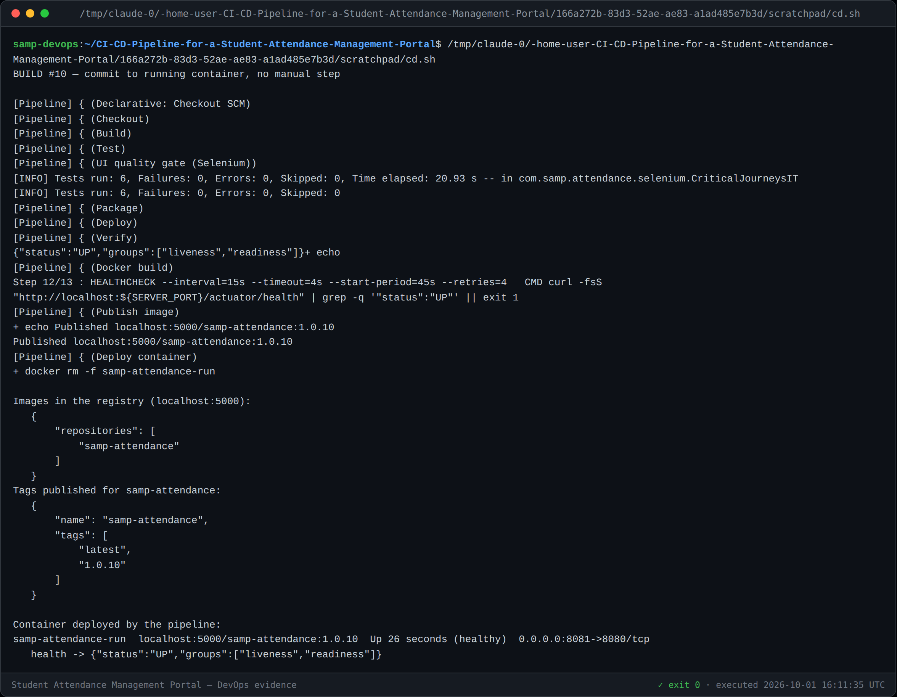

# Task 12 — Jenkins-Docker Continuous Deployment

**Pipeline:** build #10 SUCCESS — commit → image `1.0.10` → registry → running container
**Registry:** `localhost:5000` · **Container:** `samp-attendance-run` healthy on `:8081`
**Version:** 1.0

---

## 1. Four stages turn a commit into a running container

Added after the quality gate, so **nothing is built, published or deployed unless
the Selenium journeys pass**:

| Stage | Does |
|---|---|
| **Docker build** | Builds `samp-attendance:1.0.${BUILD_NUMBER}` with the version, build number and git SHA as labels |
| **Publish image** | Tags and pushes `:1.0.N` **and** `:latest` to the registry |
| **Deploy container** | Removes the old container, runs a **fresh** one from the image just published |
| **Verify container** | Polls Docker's own health status, dumps container logs and fails if it never becomes healthy |



---

## 2. Two decisions worth defending

### Both `:1.0.N` and `:latest` — the version tag is what makes rollback possible

`latest` cannot name the release you want to go *back* to. A deployment tagged
only `latest` is a deployment you cannot reverse, which is exactly the capability
Task 14 has to demonstrate. Every image therefore carries the build number, and
the running container can always be traced to the pipeline run that produced it:

```
samp-attendance-run  localhost:5000/samp-attendance:1.0.10  Up (healthy)  0.0.0.0:8081->8080/tcp
```

### A fresh container, not a restart

`docker rm -f` then `docker run` from the newly published image, rather than
restarting the existing container. A restart would keep the old image and only
pick up new configuration — so what ran would not be what was tested. The point of
building an immutable image is lost the moment you reuse a container across versions.

---

## 3. How Jenkins reaches Docker

The Docker socket is mounted, and the Jenkins user joins the host's docker group
via `group_add` on its GID — rather than `chmod 666` on the socket, which would
hand every process on the machine control of the container runtime.

The Docker **CLI is bind-mounted** from the host because `apt` is blocked here
(`deb.debian.org` → 403). The binary is portable enough to run from the Debian
Jenkins image, which was verified before relying on it.

> **Honest note on the trust boundary.** Mounting the Docker socket gives the
> build effectively root-equivalent control of the host's container runtime. It is
> acceptable here because Jenkins, the registry and the workload are the same
> single-node sandbox. On a shared or production Jenkins it would not be: the
> right answers there are a dedicated build agent, a rootless daemon, or a
> socket-proxy restricted to the calls the pipeline actually needs.

---

## 4. Registry

A **local registry** (`registry:2` on `:5000`) is the default so the pipeline is
self-contained and needs no credentials. `REGISTRY` is a pipeline parameter, so
publishing to Docker Hub instead is a parameter change — `docker.io/<user>` plus a
credentials binding — rather than an edit to the Jenkinsfile.

```
GET /v2/_catalog               -> { "repositories": ["samp-attendance"] }
GET /v2/samp-attendance/tags/list -> tags include 1.0.10 and latest
```

---

## 5. A recurring Jenkins behaviour, hit a second time

Build #9 failed with:

```
error parsing reference: "/samp-attendance:1.0.9" is not a valid repository/tag
```

`REGISTRY` was empty. This is the same behaviour recorded in Task 8: **Jenkins
only learns a pipeline's parameters by running the Jenkinsfile once**, so newly
added parameters are empty on the run that introduces them. Build #10, with the
parameters registered, succeeded unchanged.

Worth noting that the failure was *loud* rather than silent — the stage errored
instead of pushing an untagged image somewhere unexpected.

---

## 6. Success criteria

| ID | Criterion | Evidence |
|---|---|---|
| **S14** | Every image tagged with build number **and** `latest` | `1.0.10` + `latest` in the registry |
| **S15** | **No manual step** between `git push` and a running container | Build #10 end to end |
| S13 | Container healthy within 60 s | Healthy, verified by the pipeline |
| AC-22.3 | Images published to a registry | `/v2/_catalog` |

---

## 7. Task 12 deliverable checklist

- [x] Versioned Docker image built by the pipeline (§1)
- [x] Published to a registry (§4)
- [x] Fresh container deployed automatically after tests pass (§1, §2)
- [x] Registry evidence (§4)
- [x] End-to-end commit-to-container pipeline (§6, S15)
- [x] Screenshot evidence in `docs/evidence/task-12/`
