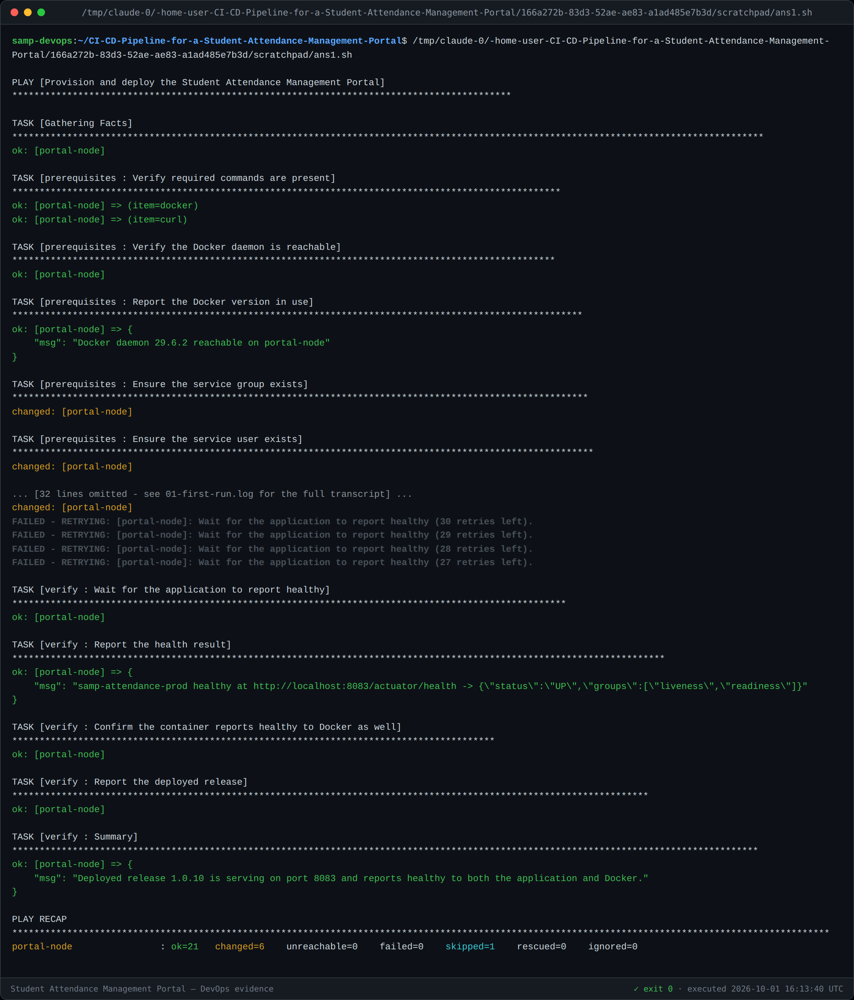

# Task 13 — Configuration Management Script

**Tool:** Ansible (core 2.19) · **Layout:** [`ansible/`](../ansible/)
**First run:** `ok=21 changed=6 failed=0`
**Version:** 1.0

---

## 1. Why Ansible rather than Puppet

The brief allows either. Ansible was chosen because it is **agentless** — no agent
to install on the target before configuration can begin — and because its
`changed=N` recap makes the idempotency requirement (S16) directly evidenced
rather than argued.

---

## 2. Configuration specification — the server prerequisites

Identified from the architecture (Task 3) and encoded in
[`group_vars/all.yml`](../ansible/group_vars/all.yml):

| Category | Requirement |
|---|---|
| **Commands** | `docker`, `curl` — verified present before anything else runs |
| **Services** | Docker daemon reachable |
| **User** | `samp` (uid 1001), system account, `/usr/sbin/nologin`, no home |
| **Group** | `samp` (gid 1001) |
| **Directories** | `/opt/samp`, `/opt/samp/data`, `/opt/samp/logs` — owned by `samp`, mode 0755 |
| **File** | `/opt/samp/current-release` — records the deployed version, so a rollback knows what to return to |
| **Port** | 8083 published for the portal container (Task 3 port map) |
| **Image** | `localhost:5000/samp-attendance:<version>` |

Nothing above is hard-coded in a task; every value is a variable, so retargeting
the playbook is a variables change.

---

## 3. Structure

```
ansible/
├── ansible.cfg            inventory path, no host-key prompt
├── inventory.ini          the [portal] group
├── group_vars/all.yml     all the values from §2
├── site.yml               provision + deploy + verify
├── rollback.yml           roll back to a named release
└── roles/
    ├── prerequisites/     commands, daemon, user, group, directories, port
    ├── deploy/            pull image, replace container, record release
    └── verify/            health check, Docker health, release summary
```

`site.yml` composes the three roles; `rollback.yml` **reuses the same deploy and
verify roles** with a different version rather than defining a parallel recovery
path. A recovery path exercised only during an incident is a path that does not
work during an incident.

---

## 4. How idempotency is achieved

It does not come for free from using Ansible — several tasks would report
`changed` on every run if written naively:

| Task | Naive behaviour | What was done |
|---|---|---|
| `which docker` | `command` always reports changed | `changed_when: false` — a check changes nothing |
| `touch` the release file | `touch` always updates mtime | `modification_time: preserve`, `access_time: preserve` |
| `docker pull` | always reports changed | `changed_when: "'Downloaded newer image' in stdout"` |
| `docker run` | would start a duplicate container | guarded by `when: currently_running != target_image` |
| `docker inspect` on a missing container | fails the play | `failed_when: false` — absent is a normal state, not an error |

The deploy role first **inspects what image the running container was created
from** and compares it to the desired image. Everything else follows from that one
comparison.

---

## 5. First execution



```
PLAY RECAP
portal-node : ok=21  changed=6  unreachable=0  failed=0  skipped=1
```

The six changes are the real provisioning work: group, user, three directories,
and the container. Everything else was already in the desired state.

---

## 6. Task 13 deliverable checklist

- [x] Server prerequisites identified — packages, users, folders, files, ports, services (§2)
- [x] Configuration specification (§2)
- [x] Ansible inventory and YAML playbook (§3)
- [x] First execution log (§5) — `changed=6 failed=0`
- [x] Screenshot evidence in `docs/evidence/task-13/`
