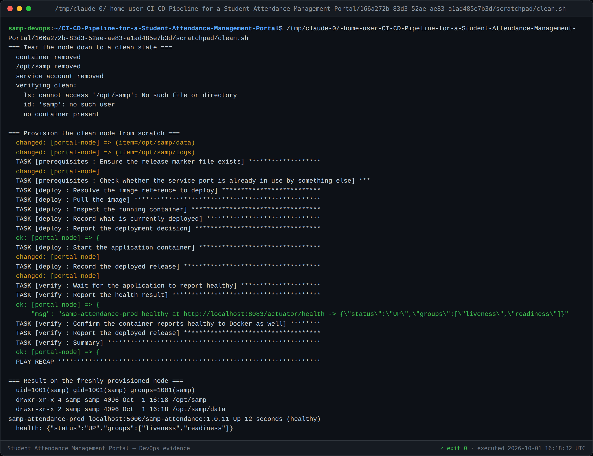
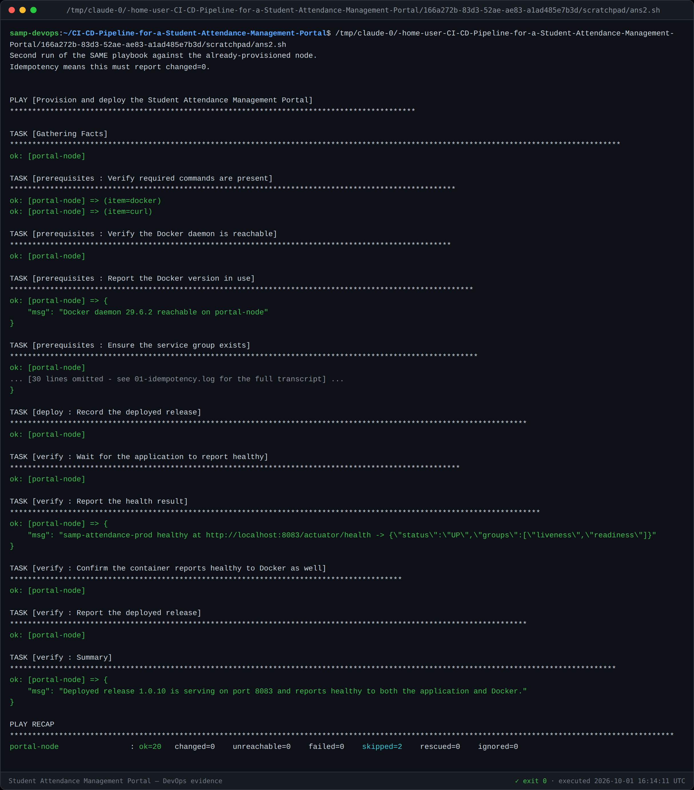
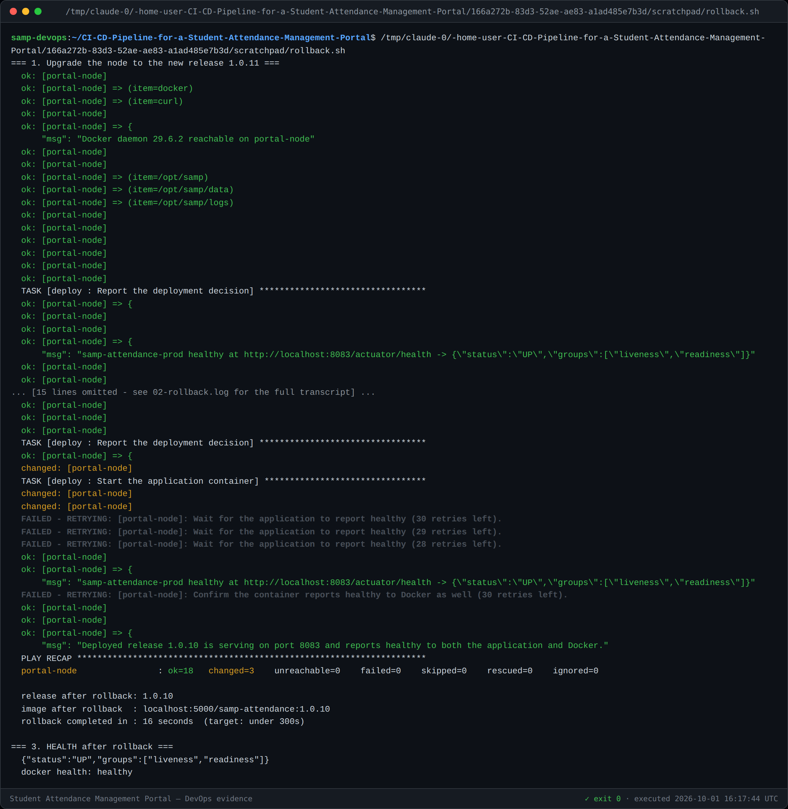

# Task 14 — Automated Provisioning and Reliability Validation

**Idempotency:** second run `changed=0` · **Rollback:** 1.0.11 → 1.0.10 in **16 s**
**Clean provision:** node torn down and rebuilt from scratch, healthy
**Version:** 1.0

---

## 1. Provisioning a clean environment

The node was genuinely torn down first — container removed, `/opt/samp` deleted,
the `samp` user and group deleted — and then rebuilt by the playbook alone.



```
container removed · /opt/samp removed · service account removed
  → no container present

ansible-playbook site.yml -e app_version=1.0.11

uid=1001(samp) gid=1001(samp)
drwxr-xr-x 4 samp samp /opt/samp
drwxr-xr-x 2 samp samp /opt/samp/data
samp-attendance-prod  localhost:5000/samp-attendance:1.0.11  Up 12 seconds (healthy)
health: {"status":"UP","groups":["liveness","readiness"]}
```

Nothing was done by hand. The user, the directories, the container and a healthy
service all came from the playbook.

---

## 2. Idempotency — `changed=0`



```
PLAY RECAP
portal-node : ok=20  changed=0  unreachable=0  failed=0  skipped=2
```

**Success criterion S16 is met.** Running the same playbook against an
already-configured node changes nothing. How each task achieves that is in
[Task 13 §4](13-configuration-management.md#4-how-idempotency-is-achieved) — it
required deliberate work on five tasks that would otherwise have reported
`changed` forever.

---

## 3. Health check

The `verify` role fails the play unless **both** of these hold:

1. `/actuator/health` returns HTTP 200 **and** the body contains `"status":"UP"`.
2. Docker's own `HEALTHCHECK` reports `healthy`.

Checking both matters: the application can answer before Docker has recorded it,
and Docker can report healthy for a container whose HTTP endpoint is degraded.
A deployment that started but does not answer is not a deployment, so the play
fails rather than reporting success for a broken release.

---

## 4. Rollback and recovery



```
Rolling back from 1.0.11 to 1.0.10
PLAY RECAP  portal-node : ok=18  changed=3  failed=0

release after rollback: 1.0.10
image after rollback  : localhost:5000/samp-attendance:1.0.10
rollback completed in : 16 seconds   (target: under 300s)
health: {"status":"UP"}   docker health: healthy
```

**Success criterion S17 is met** — previous stable release restored and healthy in
16 seconds against a 5-minute target.

### Two design choices that made this work

**The version tag is what makes rollback possible.** Task 12 tags every image with
its build number as well as `latest`, because `latest` cannot name the release you
want to go *back* to.

**The rollback verifies the target exists before touching anything.** The
`rollback.yml` pre-task queries the registry manifest for the target version
*before* the deploy role removes the running container. Discovering the target is
missing after the teardown turns a rollback into an outage.

---

## 5. Two real defects found by running this

Both were found because the playbook was executed rather than reviewed.

### The rollback refused to proceed — and that was correct

The first rollback attempt failed on the manifest pre-check:

```
MANIFEST_UNKNOWN: OCI manifest found, but accept header does not support OCI manifests
```

BuildKit publishes **OCI** manifests; the pre-check's `Accept` header listed only
the Docker v2 media types, so the registry answered 404 for an image that was
actually present.

The bug was in the check, not the image — but **the safety design worked exactly
as intended**: the play stopped at the pre-check, the running 1.0.11 container was
never touched, and the service stayed healthy throughout. A rollback that fails
safely is a very different thing from one that fails halfway. The `Accept` header
now covers both OCI and Docker media types.

### The Docker health check raced the daemon

Verification failed with `stdout: "starting"`. The application answers
`/actuator/health` as soon as it is up, but Docker only records `healthy` after
its `HEALTHCHECK` interval has elapsed past the `start-period`, so checking
immediately races the daemon. The task now retries until healthy rather than
sampling once.

---

## 6. Success criteria

| ID | Criterion | Target | Actual |
|---|---|---|---|
| **S16** | Idempotency | 2nd run `changed=0` | **`changed=0`** |
| **S17** | Rollback | ≤ 5 minutes, healthy | **16 seconds**, healthy |
| AC-24.1 | Prerequisites declared in a playbook | — | ✅ |
| AC-24.3 | Health check confirms the deployment | — | ✅ both application and Docker |

---

## 7. Task 14 deliverable checklist

- [x] Clean target environment provisioned (§1)
- [x] Application/container deployed (§1)
- [x] Idempotency demonstrated (§2) — `changed=0`
- [x] Health check result (§3)
- [x] Rollback/recovery to the previous stable release (§4) — 16 s
- [x] Screenshot evidence in `docs/evidence/task-14/`
