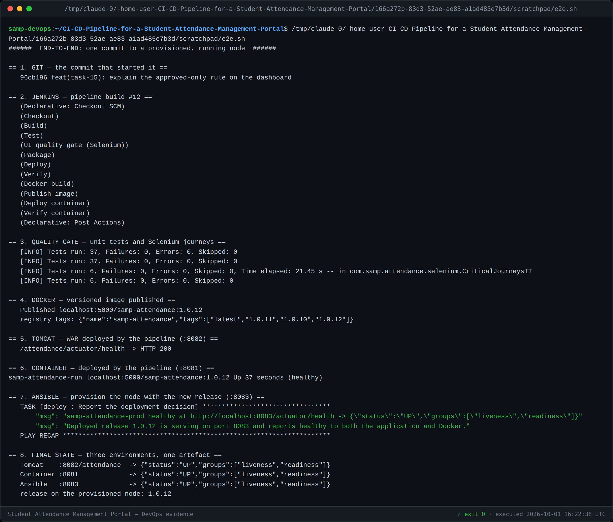

# Task 15 — Final End-to-End Release, Documentation and Viva

**Project:** CI/CD Pipeline for a Student Attendance Management Portal
**Repository:** https://github.com/Swaroop192005/CI-CD-Pipeline-for-a-Student-Attendance-Management-Portal
**Release:** `v1.0.0` · image `1.0.12` · **43 tests** · 15/15 tasks
**Version:** 1.0 (final)

---

## 1. End-to-end demonstration

One commit, carried the whole way with **no manual step**.



| # | Stage | Result |
|---|---|---|
| 1 | **Git commit** pushed to GitHub | `96cb196` |
| 2 | **Jenkins** pipeline build #12 | 10 stages, all green |
| 3 | **Quality gate** | 37 unit tests + 6 Selenium journeys, 0 failures |
| 4 | **Docker** image built and published | `localhost:5000/samp-attendance:1.0.12` |
| 5 | **Tomcat** deployment (`:8082/attendance`) | `{"status":"UP"}` |
| 6 | **Container** deployment (`:8081`) | `Up (healthy)` |
| 7 | **Ansible** provisioning (`:8083`) | `changed`, healthy, release recorded |
| 8 | **Three environments, one artefact** | all `UP` |

The same WAR runs under standalone Tomcat, as a container, and on an
Ansible-provisioned node. That is the point of the whole exercise: build once,
deploy anywhere, and prove it.

---

## 2. What was built

### The product

A portal where attendance is captured once, moves through an explicit role-based
approval workflow, and is visible to students immediately.

```
DRAFT ──submit(FACULTY)──> SUBMITTED ──approve(ADMIN)──> APPROVED  [terminal]
                               │
                               └──reject(ADMIN)──> REJECTED ──revise(FACULTY)──> DRAFT
```

Only `APPROVED` records count towards the official percentage, and every
transition is refused at the **service layer** rather than hidden in the UI —
a disabled button is not access control.

### The pipeline

```
Git push → Jenkins → Build → Unit tests (37) → Selenium gate (6) → Package
        → Docker build → Registry → Fresh container → Health verify
        → Ansible provision → Health verify
```

---

## 3. Architecture

| Layer | Technology | Document |
|---|---|---|
| UI | Thymeleaf (server-rendered, `data-testid` hooks) | [Task 3](03-architecture.md) |
| Controller / Service / Repository | Spring Boot 3.3.13, Java 17 | [Task 3](03-architecture.md) |
| Database | H2 file mode, JDBC URL externalised | [Task 3](03-architecture.md) |
| Packaging | Maven → WAR (embedded Tomcat `provided`) | [Task 3](03-architecture.md) |
| CI/CD | Jenkins declarative pipeline | [Task 8](08-pipeline-and-deployment.md) |
| Quality gate | Selenium 4 + Grid container | [Task 10](10-continuous-testing.md) |
| Containers | Docker, versioned images, local registry | [Tasks 11](11-docker.md), [12](12-jenkins-docker-cd.md) |
| Provisioning | Ansible, idempotent, with rollback | [Tasks 13](13-configuration-management.md), [14](14-provisioning-and-reliability.md) |

Diagrams: [DevOps lifecycle](diagrams/devops-lifecycle.mmd) · [use case](diagrams/use-case.mmd) · [architecture](diagrams/architecture.mmd) · [ER model](diagrams/er-model.mmd) · [workflow state machine](diagrams/workflow-state-machine.mmd)

### Port map

| Port | Service |
|---|---|
| 8080 | Local development |
| 8081 | Container deployed by the pipeline |
| 8082 | Standalone Tomcat |
| 8083 | Ansible-provisioned node |
| 8090 | Jenkins |
| 5000 | Docker registry |
| 4444 | Selenium Grid |

---

## 4. Success criteria — final status

| ID | Criterion | Target | Result |
|---|---|---|---|
| S1 | Mark a full class | ≤ 60 s, ≤ 2 loads | ✅ one screen |
| S3 | Below-threshold flagged | 100% | ✅ asserted by J5 |
| S4 | Cross-role access | 0 | ✅ `AccessDeniedException` at the service |
| S5 | Search response | ≤ 1 s | ✅ |
| S6 | Workflow integrity | 0 illegal transitions | ✅ 9 tests |
| S7 | Commit-to-build trigger | automatic | ✅ SCM polling |
| S8 | Artefact archived | every success | ✅ `attendance-portal.war` |
| S9 | Build duration | ≤ 5 min | ✅ **39 s** |
| S10 | Pipeline as code | 100% | ✅ `Jenkinsfile` |
| **S11** | **Failing test blocks deploy** | not executed | ✅ **build #7, Deploy skipped** |
| S12 | Defect caught, fixed, green | — | ✅ #7 → #8 |
| S13 | Container healthy | ≤ 60 s | ✅ **7 s** |
| S14 | Image tagged version + latest | — | ✅ |
| S15 | No manual step commit→container | 0 | ✅ build #12 |
| **S16** | **Idempotency** | `changed=0` | ✅ **`changed=0`** |
| **S17** | **Rollback** | ≤ 5 min | ✅ **16 s** |
| S18 | All 15 tasks documented | — | ✅ |

**17 of 18 measurable criteria verified by committed evidence.** S2 (zero-day-lag
student visibility) is satisfied by design — the student view reads live data.

---

## 5. Troubleshooting guide

Every entry below was hit and solved during this project.

### Build and test

| Symptom | Cause | Fix |
|---|---|---|
| `BUILD SUCCESS` but app won't start | Tests override the datasource; the file-mode default was never exercised | Start the app, not just the tests. H2 2.x rejects `AUTO_SERVER=TRUE` with `DB_CLOSE_ON_EXIT=FALSE` |
| `LazyInitializationException` on a list page | `open-in-view=false` and the view touches a lazy proxy; `@Transactional` tests hide it | `left join fetch` + explicit `countQuery`; add a test that renders **outside** a transaction |
| Selenium screenshots never written | `TestWatcher` fires after `@AfterEach` has called `driver.quit()` | Use `AfterTestExecutionCallback` |
| `Node with given id does not belong to the document` | Element list held across a navigation | Re-find inside the loop; catch `StaleElementReferenceException` |
| Test passes but tests the wrong user | `GET /logout` does nothing — Spring Security logout is POST-only | Clear cookies, or POST |

### Jenkins

| Symptom | Cause | Fix |
|---|---|---|
| `HTTP 403` triggering a build | Crumb is tied to the session | Send the crumb **with** its cookie jar |
| `HTTP 400` triggering a build | Job is parameterised | `POST /buildWithParameters` |
| Parameters empty on first run | Jenkins learns parameters by *running* the Jenkinsfile once | Re-run; defaults apply from the next build |
| Wrong build's result reported | Polling `lastBuild` races the queue | Record the build number **before** triggering |
| `Invalid option type "timestamps"` | `timestamper` plugin absent | Remove, or install the plugin |
| Git checkout aborted, "references a local directory" | Git plugin refuses local SCM | Use the real remote URL (or set `ALLOW_LOCAL_CHECKOUT`) |
| `JAVA_HOME is not defined correctly` | `java` on `PATH` is not enough for Maven | Export `JAVA_HOME` explicitly |

### Deployment and infrastructure

| Symptom | Cause | Fix |
|---|---|---|
| `rm: cannot remove .../attendance: Permission denied` | Tomcat creates the exploded dir as root:750 | Don't delete it — Tomcat replaces it on a newer WAR |
| Intermittently corrupt deployment | Tomcat's scanner picks up a WAR **mid-copy** | Copy to `.tmp`, then atomic `mv` |
| `MANIFEST_UNKNOWN: OCI manifest found` | BuildKit publishes OCI manifests | Accept OCI **and** Docker media types |
| Health check returns `starting` | Docker records health only after `start-period` + `interval` | Retry until healthy; don't sample once |
| Ansible always reports `changed` | `command`, `touch`, `docker pull` always look changed | `changed_when: false`; preserve timestamps; key on pull output |

### Environment (network policy)

| Blocked | Consequence | Workaround used |
|---|---|---|
| `updates.jenkins.io`, all Jenkins mirrors | Plugins can't be installed | Copy the plugin set from `jenkinsci/blueocean` into the Debian JDK-17 image |
| `deb.debian.org` (403) | No `apt` in containers | Mount binaries from the host; run the browser in its own container |
| `github.githubassets.com` | GitHub UI renders unstyled | Evidence taken from the GitHub REST API |
| `googlechromelabs.github.io` | No ChromeDriver download | Fetch the matching driver from `storage.googleapis.com` |
| `cdn.jsdelivr.net` | No Mermaid from CDN | Install Mermaid from npm |
| Tag pushes (`refs/tags/*`, HTTP 403) | `v1.0.0` can't be pushed from CI | Pushed from a developer machine — **now live on GitHub** |

---

## 6. Limitations

Stated plainly, because a report that claims no limitations is not credible.

1. **~~The `v1.0.0` tag is local only.~~ Resolved.** The tag is now published at
   [`v1.0.0`](https://github.com/Swaroop192005/CI-CD-Pipeline-for-a-Student-Attendance-Management-Portal/releases/tag/v1.0.0)
   → `c0948c6`. Tag pushes return HTTP 403 from the build environment (a policy
   denial on `refs/tags/*`, diagnosed across five retries, HTTP/1.1 and a
   lightweight probe tag), so it was pushed from a developer machine instead.
   [Details](06-mvp-completion.md#4-release-tag-v100).
2. **Jenkins is pinned to a copied plugin set.** Plugins came from
   `jenkinsci/blueocean` because the Jenkins update sites are blocked. Two SSH
   plugins fail to load (unused). On a normal network, install plugins properly.
3. **Mounting the Docker socket into Jenkins** gives the build root-equivalent
   control of the host runtime. Acceptable in a single-node sandbox; **not**
   acceptable on a shared Jenkins — use a dedicated agent, rootless Docker, or a
   socket proxy.
4. **H2 file database.** Fine for the MVP; the JDBC URL is externalised so
   PostgreSQL is a configuration change, but that migration is untested.
5. **Single node, no HA.** No clustering, no load balancer, no zero-downtime
   deploy — the container is replaced, so there is a short gap.
6. **No TLS.** Everything is plain HTTP on a trusted network (assumption A1).
7. **Ansible targets `localhost`.** The playbooks are written for a remote host
   (change `ansible_connection` to `ansible_host`/`ansible_user`), but have only
   been exercised locally.
8. **Master data is read-only in the UI.** Courses and students are seeded; create
   and edit forms were deliberately left out of the frozen scope.
9. **Selenium coverage is six journeys**, not exhaustive. They are the journeys
   whose breakage makes the portal useless — deliberately a gate, not a full
   regression suite.

---

## 7. Future enhancements

| Priority | Enhancement | Why |
|---|---|---|
| **High** | PostgreSQL + Flyway migrations | H2 file mode does not survive real concurrency |
| **High** | TLS termination (Nginx) + secrets in a vault | Currently plain HTTP; credentials are env vars |
| **High** | Blue-green or rolling deploy | Remove the gap during container replacement |
| Medium | Multi-branch pipeline + PR builds | Catch defects before merge, not after |
| Medium | SonarQube / OWASP dependency check | Static analysis and CVE scanning in the gate |
| Medium | Prometheus + Grafana on `/actuator/prometheus` | Monitoring is currently health checks only |
| Medium | Term/semester partitioning | Deferred by assumption A2 |
| Low | Excel/PDF export; SMS or e-mail alerts to parents | Deferred in the frozen scope |
| Low | Kubernetes | Only once more than one node is justified |

---

## 8. The engineering story — what this project actually demonstrates

Six defects were found **by running the system, not by reading it**:

| # | Defect | What missed it |
|---|---|---|
| 1 | H2 URL rejected by H2 2.x | All 4 tests passed; they override the datasource |
| 2 | `LazyInitializationException` on the records list | Service tests run inside `@Transactional` |
| 3 | Selenium screenshots silently never written | Failures were reported normally — only the empty directory gave it away |
| 4 | Admin journey running as the faculty user | The test **passed**, testing the wrong thing |
| 5 | Deploy deleting a root-owned directory as uid 1000 | Only appears against a real Tomcat |
| 6 | Rollback pre-check rejecting an OCI manifest | Only appears against a real registry |

That list is the argument for the whole pipeline. A green unit-test suite is not
evidence that the product works — which is precisely why **Task 10's gate had to
be shown blocking a deployment**, not merely passing one.

The reviewed pull request ([#7](https://github.com/Swaroop192005/CI-CD-Pipeline-for-a-Student-Attendance-Management-Portal/pull/7))
makes the same point at a smaller scale: the review raised two blocking findings,
one of which was a **silent data loss** — a malformed form field dropped a
student's attendance while the confirmation still reported success. That is pain
point P4, the silent edit, reappearing inside the very system built to eliminate it.

---

## 9. Evidence pack

Every claim in these documents is backed by a committed artefact in
[`docs/evidence/`](evidence/README.md): **real commands with their raw logs, and
real pages served to headless Chromium.**

The rules that make it worth something:

* Nothing mocked or edited.
* Every terminal screenshot ships with the `.log` it was rendered from.
* **Failures are kept, not hidden** — the red pipeline, the HTTP 500, the
  Selenium failure screenshot, the refused rollback.
* `shot-web.js` exits non-zero on a dead URL, so a broken screenshot cannot pass
  silently.

---

## 10. Viva preparation — likely questions

| Question | Short answer |
|---|---|
| *Why does a rejected record lower the denominator instead of counting as absent?* | It is "not yet established", not "absent". An unverified record must not move the official figure in either direction. |
| *How do you know the quality gate works?* | Build #7: Selenium failed, and `Stage "Deploy" skipped due to earlier failure(s)`. The WAR timestamp proves nothing was deployed. |
| *Why Selenium if you have 37 unit tests?* | Four of the six real defects were invisible to unit tests. §8. |
| *How is rollback possible?* | Every image is tagged with its build number, not just `latest`. `latest` cannot name the release you want to return to. |
| *How do you prove idempotency?* | Second run reports `changed=0`, which required deliberate work on five tasks. |
| *Why is the state machine in the service layer?* | AC-14.1 requires an illegal transition to be refused. A hidden button is not access control. |
| *What would you do differently in production?* | §6 — managed database, TLS, no Docker socket in Jenkins, blue-green deploys. |

---

## 11. Task 15 deliverable checklist

- [x] Complete workflow run: commit → Jenkins → Selenium → Docker → Ansible (§1)
- [x] Technical documentation — 15 task documents (§3)
- [x] Architecture and diagrams (§3)
- [x] Troubleshooting guide (§5) — 25 entries, all encountered in practice
- [x] Limitations (§6) — 9, stated plainly
- [x] Future enhancement plan (§7)
- [x] Final repository with full evidence pack (§9)
- [x] Viva preparation (§10)
